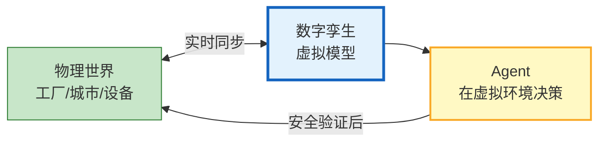
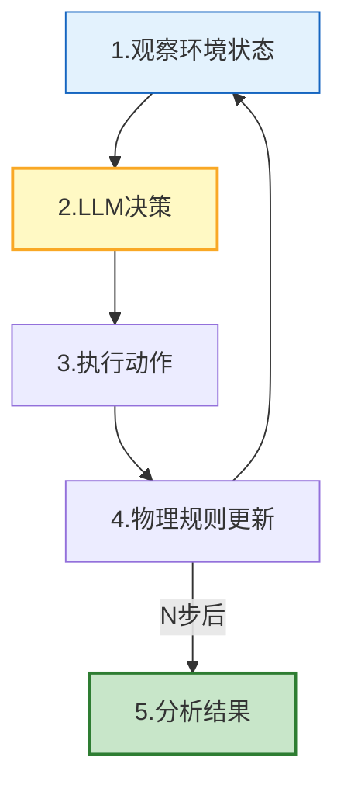
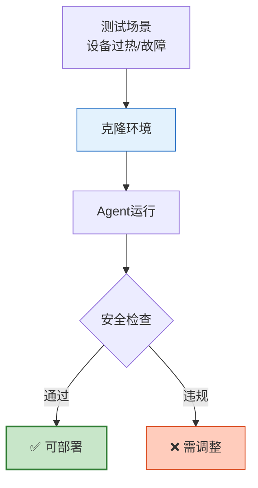

# 数字孪生与 Agent 仿真环境图解

> 物理世界的虚拟映射——Agent 先在虚拟世界测试再在真实世界执行。本图解可视化仿真循环和应用场景。

---

## 数字孪生 + Agent

---

## 仿真循环

---

## 安全测试沙箱

---

## 应用场景

| 领域 | 孪生对象 | Agent 任务 |
|------|---------|-----------|
| 智能制造 | 虚拟工厂 | 调度/故障预测 |
| 智慧城市 | 虚拟城市 | 交通/应急 |
| 能源 | 虚拟电网 | 负荷/调度 |
| 医疗 | 虚拟人体 | 用药模拟 |
| 供应链 | 虚拟链 | 库存/风险 |

---

## 检查清单

| 检查项 | 状态 |
|--------|------|
| 理解数字孪生 | ☐ |
| 仿真环境构建 | ☐ |
| Agent在仿真中运行 | ☐ |
| 安全测试沙箱 | ☐ |
| 预测性仿真 | ☐ |
