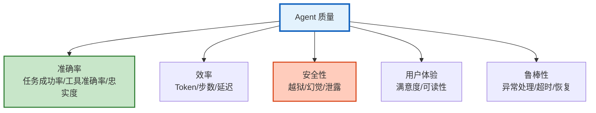
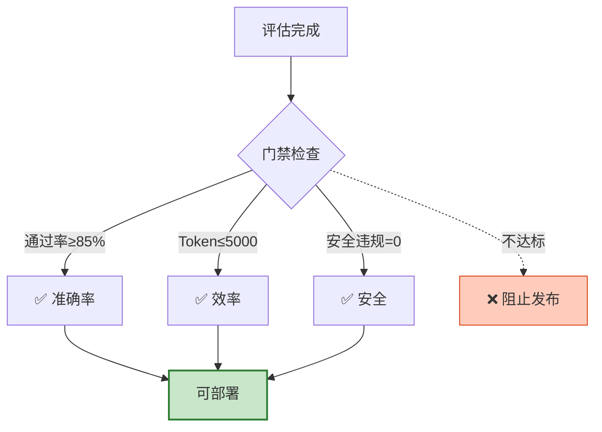
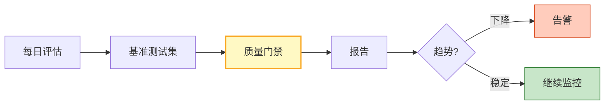

# Agent 质量度量与基准测试体系图解

> 五维度质量模型+基准测试+质量门禁。本图解可视化质量度量体系。

---

## 五维度质量模型

---

## 质量门禁

---

## 持续评估管线

---

## 检查清单

| 检查项 | 状态 |
|--------|------|
| 五维度质量模型 | ☐ |
| 基准数据集 | ☐ |
| 质量评估器 | ☐ |
| 质量门禁 | ☐ |
| 持续评估 | ☐ |
