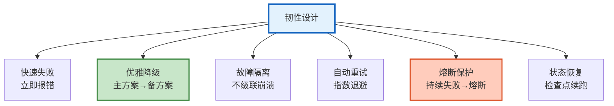
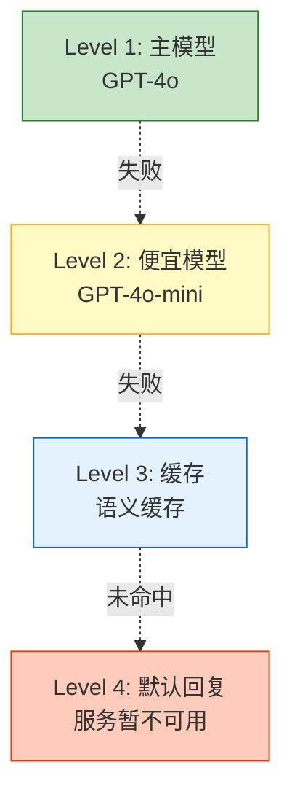
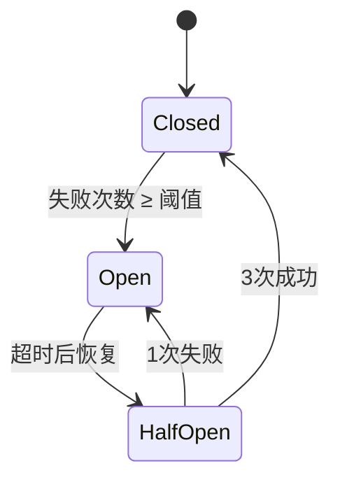

# Agent 可靠性与韧性工程图解

> 快速失败、优雅降级、熔断保护。本图解可视化韧性六原则和降级链。

---

## 韧性六原则

---

## 降级链

---

## 三态熔断器

---

## 检查清单

| 检查项 | 状态 |
|--------|------|
| 韧性六原则 | ☐ |
| 分级异常处理 | ☐ |
| 降级链 | ☐ |
| 三态熔断器 | ☐ |
| 背压限流 | ☐ |
| 健康检查自愈 | ☐ |
| 混沌工程 | ☐ |
