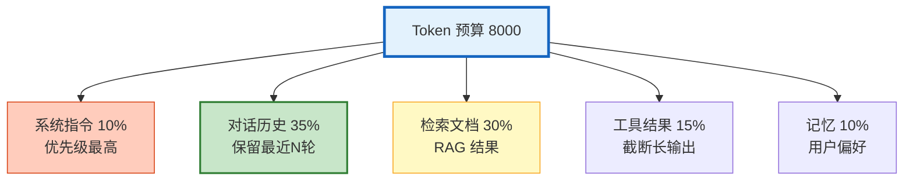
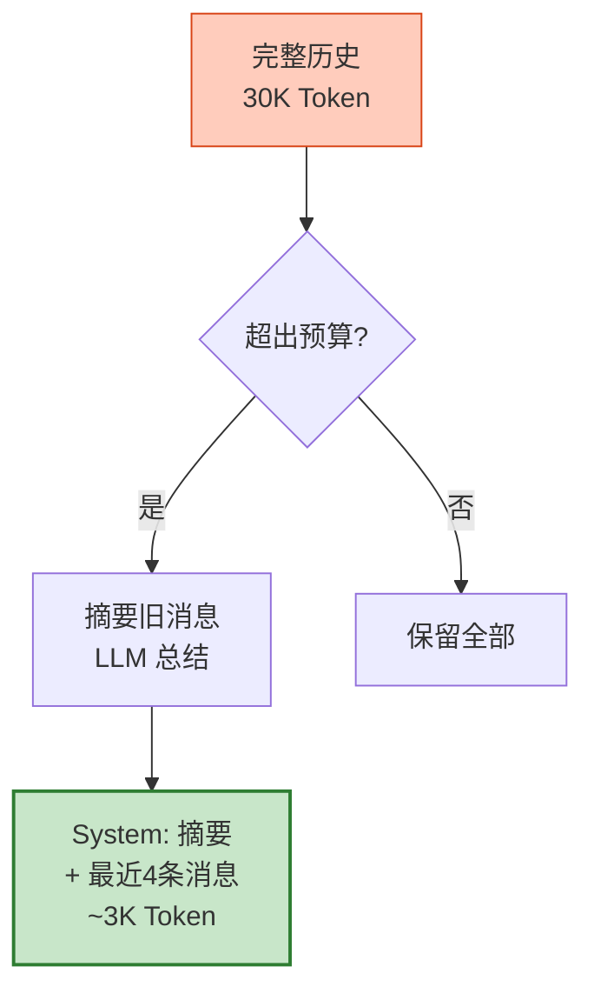
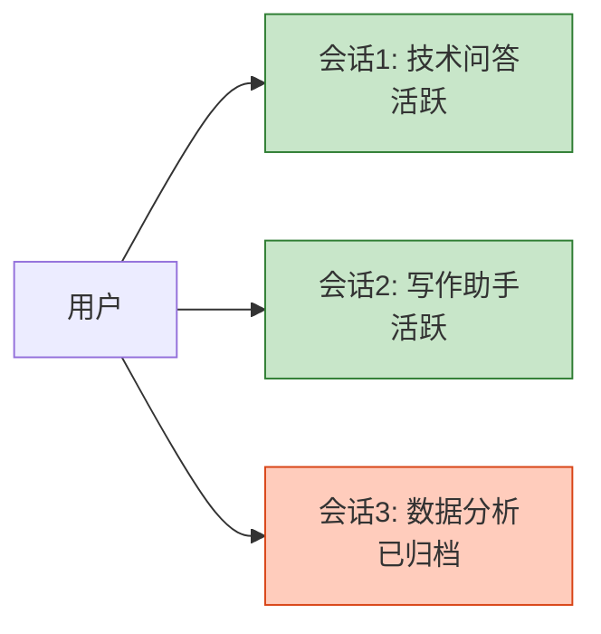

# Agent 会话管理与上下文工程图解

> 上下文窗口有限——System Prompt 10%、历史 35%、检索 30%、工具 15%、记忆 10%。本图解可视化预算分配和压缩策略。

---

## 上下文组成与优先级

---

## 上下文压缩

---

## 多会话管理

---

## 检查清单

| 检查项 | 状态 |
|--------|------|
| 上下文五大组成 | ☐ |
| Token 预算分配 | ☐ |
| 上下文压缩 | ☐ |
| 多会话管理 | ☐ |
| 优先级排序 | ☐ |
