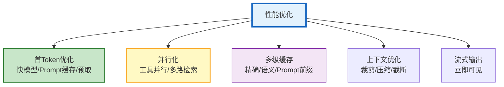
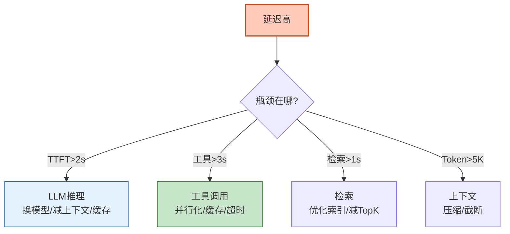

# Agent 性能调优与延迟优化图解

> 首 Token 快+吞吐量高。本图解可视化延迟拆解和优化策略。

---

## 延迟拆解

---

## 优化策略

---

## 瓶颈诊断

---

## 检查清单

| 检查项 | 状态 |
|--------|------|
| 延迟拆解 | ☐ |
| TTFT 优化 | ☐ |
| 并行化 | ☐ |
| 多级缓存 | ☐ |
| 上下文优化 | ☐ |
| 瓶颈诊断 | ☐ |
