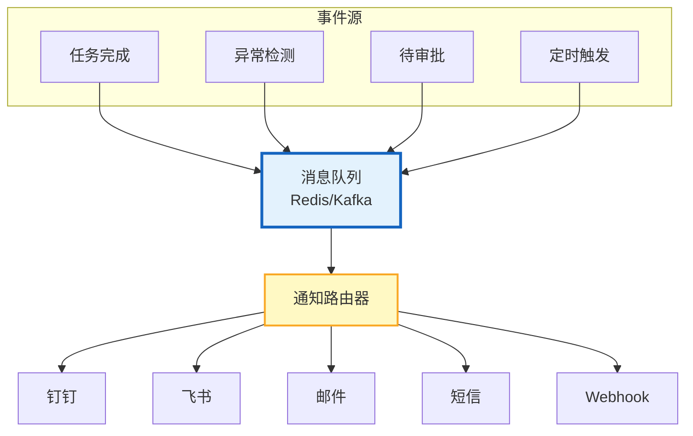

# Agent Webhook 与事件驱动通知图解

> 事件触发→路由→多渠道推送→可靠投递。本图解可视化通知系统架构。

---

## 事件驱动架构



---

## Webhook 可靠投递

```mermaid
graph TB
    SEND["发送Webhook"] --> OK{"200?"}
    OK -->|"成功"| DONE["✅ 完成"]
    OK -->|"失败"| RETRY{"重试<3?"}
    RETRY -->|"是"| WAIT["等待+退避"]
    WAIT --> SEND
    RETRY -->|"否"| DEAD["❌ 投递失败"]
    OK -->|"4xx"| NORETRY["不重试<br/>客户端错误"]

    style DONE fill:#C8E6C9,stroke:#2E7D32,stroke-width=2px
    style DEAD fill:#FFCCBC,stroke:#D84315
```

---

## 通知优先级路由

| 优先级 | 渠道 | 免打扰 |
|--------|------|--------|
| CRITICAL | 钉钉+短信+邮件 | 不受限制 |
| HIGH | 钉钉+邮件 | 限制 |
| MEDIUM | 钉钉 | 限制 |
| LOW | 应用内 | 可延后 |

---

## 检查清单

| 检查项 | 状态 |
|--------|------|
| 事件驱动架构 | ☐ |
| 通知路由器 | ☐ |
| Webhook可靠投递 | ☐ |
| Webhook注册管理 | ☐ |
| 免打扰+频率控制 | ☐ |
| 多渠道并行 | ☐ |
