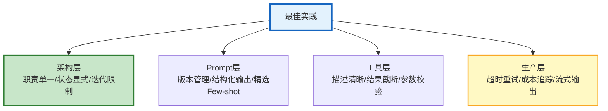
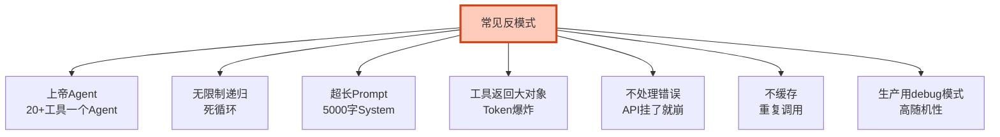

# Agent 最佳实践与反模式深度图解

> 20条最佳实践+15个反模式。本图解可视化核心原则和常见陷阱。

---

## 最佳实践分层

---

## 反模式速查

---

## 好 vs 坏对比

| 维度 | ✅ 最佳实践 | ❌ 反模式 |
|------|-----------|---------|
| Agent设计 | 职责单一 | 上帝Agent |
| System Prompt | <500字精简 | 5000字冗长 |
| 工具结果 | 截断到2000字符 | 返回50KB |
| 错误处理 | 重试+降级 | 不处理 |
| 成本监控 | 每次追踪 | 无监控 |
| 输出方式 | 流式优先 | 同步阻塞 |

---

## 检查清单

| 检查项 | 状态 |
|--------|------|
| 架构层实践 | ☐ |
| Prompt层实践 | ☐ |
| 工具层实践 | ☐ |
| 生产层实践 | ☐ |
| 知道15个反模式 | ☐ |
