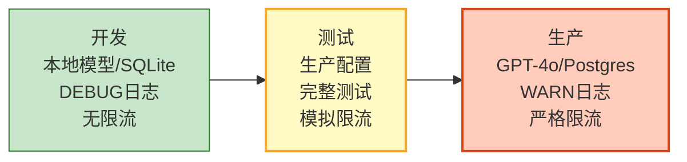
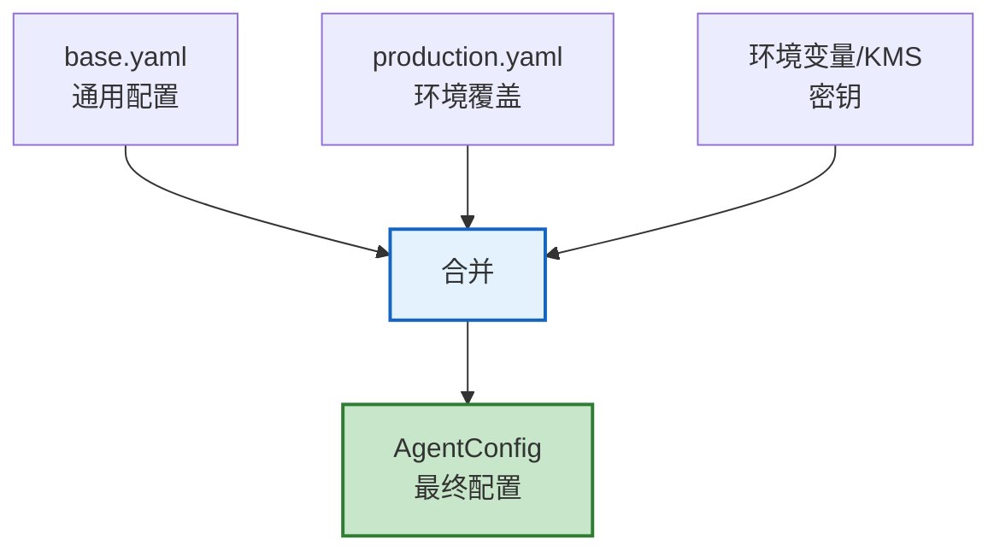
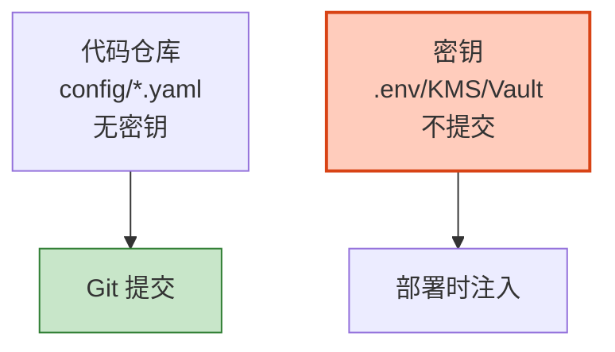

# Agent 环境管理与配置即代码图解

> 开发→测试→生产三环境隔离+配置文件化。本图解可视化多环境管理。

---

## 三环境分层

---

## 配置加载

---

## 密钥分离原则

---

## 检查清单

| 检查项 | 状态 |
|--------|------|
| 多环境配置文件 | ☐ |
| 配置加载器 | ☐ |
| 密钥不硬编码 | ☐ |
| .env不入Git | ☐ |
| 密钥轮换 | ☐ |
| 环境隔离 | ☐ |
