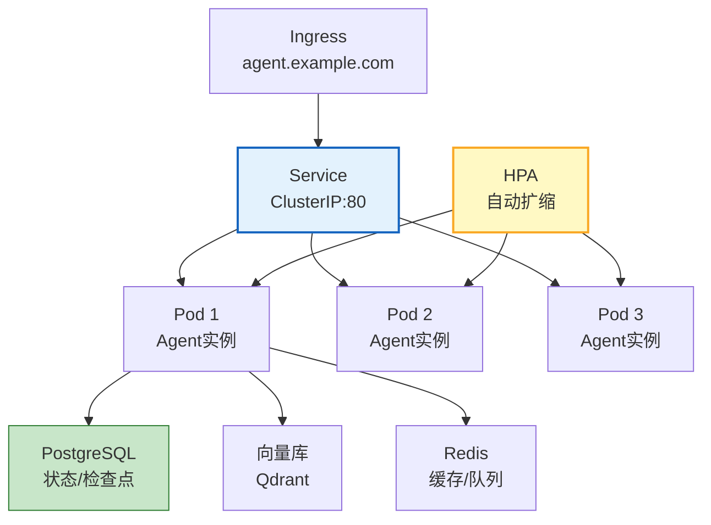
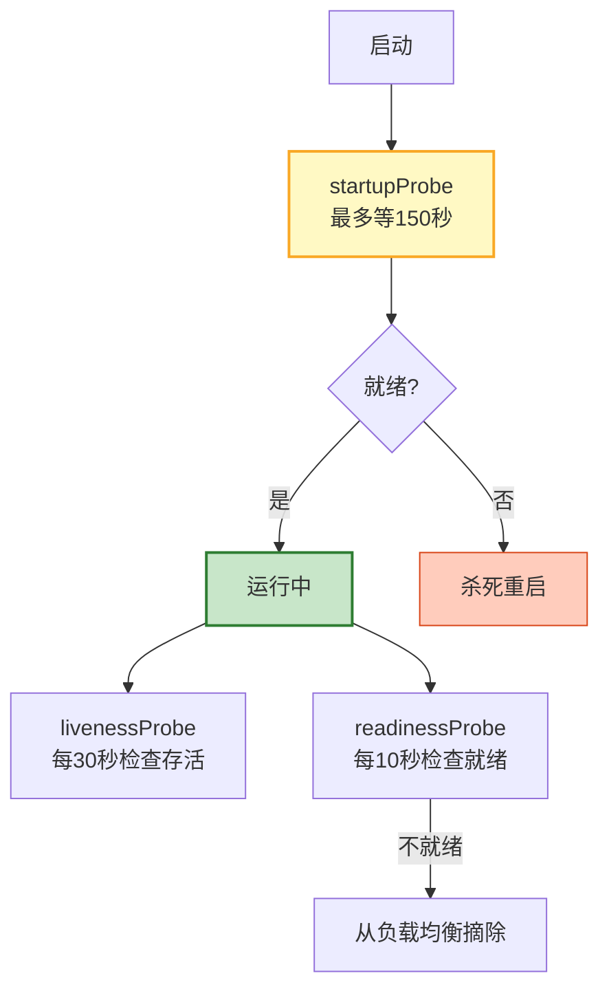

# Agent 容器化与 K8s 生产部署图解

> Docker镜像+K8s编排+HPA弹性+Helm Chart。本图解可视化容器化部署架构。

---

## K8s 部署架构



---

## 健康探针



---

## Helm Chart 结构

```
agent-chart/
├── Chart.yaml
├── values.yaml        ← 默认值
├── values-prod.yaml   ← 生产覆盖
└── templates/
    ├── deployment.yaml
    ├── service.yaml
    ├── configmap.yaml
    ├── secret.yaml
    ├── hpa.yaml
    └── ingress.yaml
```

---

## 检查清单

| 检查项 | 状态 |
|--------|------|
| Docker镜像构建 | ☐ |
| K8s Deployment | ☐ |
| 存活+就绪探针 | ☐ |
| ConfigMap+Secret | ☐ |
| HPA自动扩缩 | ☐ |
| 优雅关闭 | ☐ |
| Helm Chart | ☐ |
| Ingress配置 | ☐ |
