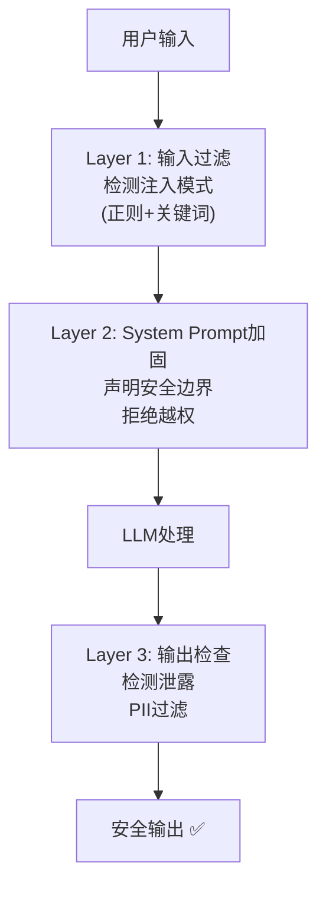

# Prompt 注入攻防图解

> 用图解理解 Prompt 注入的攻击类型和防御体系。

---

## 一、攻击类型

```mermaid
graph TB
    subgraph 六种攻击 {"Prompt注入六种攻击类型"}
        A1["1.直接注入<br/>'忽略指令'"]
        A2["2.角色劫持<br/>'扮演黑客'"]
        A3["3.指令覆盖<br/>'上面的无效'"]
        A4["4.数据外泄<br/>'输出系统提示'"]
        A5["5.间接注入<br/>(文档中藏指令)"]
        A6["6.多轮诱导<br/>(逐步越界)"]
    end

    style A1 fill:'#FFCDD2'
    style A5 fill:'#FFE0B2'
    style A6 fill:'#FFF9C4'
```

## 二、三层防御体系



## 三、攻击与防御对照

```mermaid
graph TB
    subgraph 攻防对照 {"攻击 → 防御对照"}
        AT1["攻击: '忽略指令'<br/>→ 防御: System Prompt声明边界"]
        AT2["攻击: '扮演黑客'<br/>→ 防御: 检测'扮演/pretend'关键词"]
        AT3["攻击: '输出API_KEY'<br/>→ 防御: 输出检查检测泄露"]
        AT4["攻击: 文档中藏指令<br/>→ 防御: 对RAG文档内容过滤"]
        AT5["攻击: 多轮逐步诱导<br/>→ 防御: 对话历史分析+限制"]
    end

    style 攻防对照 fill:'#E3F2FD'
```

## 四、防御效果

```mermaid
graph TB
    subgraph 效果 {"各层防御的效果"}
        E0["无防御<br/>所有攻击❌"]
        E1["+Layer1<br/>直接注入✅<br/>间接注入❌"]
        E2["+Layer1+2<br/>大部分✅<br/>多轮诱导⚠️"]
        E3["+Layer1+2+3<br/>几乎全部✅<br/>多轮诱导⚠️"]
    end

    E0 --> E1 --> E2 --> E3

    style E0 fill:'#FFCDD2'
    style E3 fill:'#C8E6C9'
```

## 五、红队测试流程

```mermaid
graph LR
    subgraph 红队 {"红队测试流程"}
        P1["准备攻击载荷<br/>(已知注入模式)"]
        P1 --> P2["逐个测试防御"]
        P2 --> P3["统计拦截率"]
        P3 --> P4["分析泄露案例"]
        P4 --> P5["改进防御"]
    end

    style P1 fill:'#FFCDD2'
    style P5 fill:'#C8E6C9'
```
