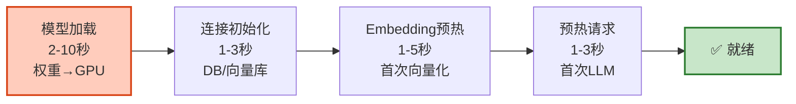
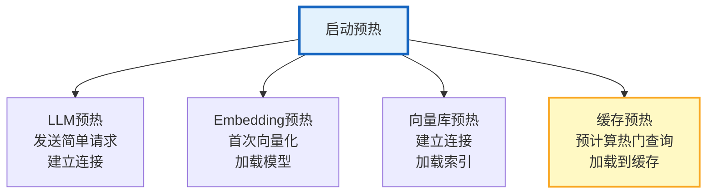
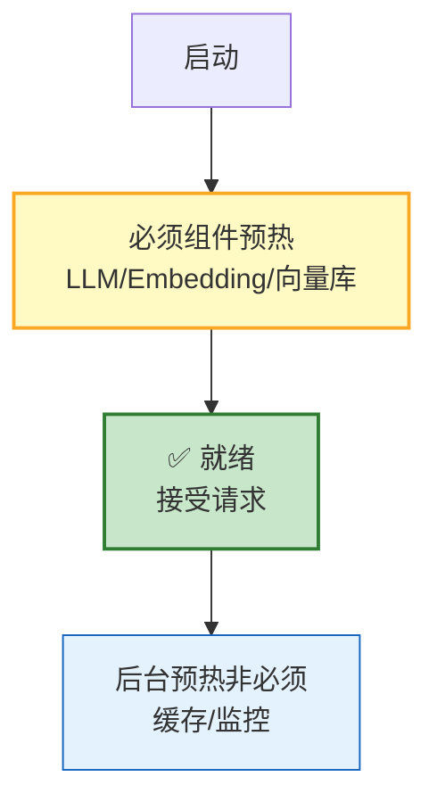

# Agent 冷启动优化与预热策略图解

> 启动后第一个请求慢？预热解决。本图解可视化冷启动阶段和预热策略。

---

## 冷启动四阶段

---

## 预热策略

---

## 渐进式就绪

---

## 冷启动 vs 预热后对比

| 指标 | 无预热 | 有预热 |
|------|--------|--------|
| 首次请求 | 5-40秒 | <2秒 |
| K8s就绪检查 | 可能超时 | 快速通过 |
| 用户体验 | 首次很慢 | 一致体验 |

---

## 检查清单

| 检查项 | 状态 |
|--------|------|
| 理解四阶段 | ☐ |
| 模型预加载 | ☐ |
| Embedding预热 | ☐ |
| 向量库预热 | ☐ |
| 缓存预热 | ☐ |
| 渐进式就绪 | ☐ |
| K8s startupProbe | ☐ |
