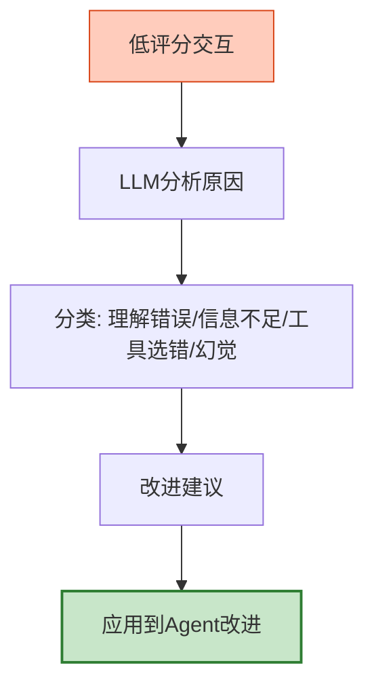

# Agent 经验沉淀与组织知识库图解

> Agent越用越聪明——经验飞轮闭环。本图解可视化经验沉淀流程。

---

## 经验飞轮

```mermaid
graph TB
    RUN["Agent运行"] --> COLLECT["收集经验<br/>成功/失败/工具使用"]
    COLLECT --> ANALYZE["分析归类<br/>失败模式+成功模式"]
    ANALYZE --> STORE["沉淀知识库"]
    STORE --> FEEDBACK["反馈改进<br/>Few-shot/评估集/工具优化"]
    FEEDBACK --> RUN

    style COLLECT fill:#E3F2FD,stroke:#1565C0,stroke-width=2px
    style FEEDBACK fill:#C8E6C9,stroke:#2E7D32,stroke-width:2px
```

---

## 经验类型

| 类型 | 来源 | 反馈方式 |
|------|------|---------|
| 成功案例 | 高评分回答 | 加入Few-shot |
| 失败案例 | 低评分回答 | 加入评估集 |
| 工具经验 | 工具调用记录 | 优化描述 |
| 错误恢复 | 错误后恢复 | 加入Runbook |
| 用户偏好 | 用户反馈 | 更新画像 |

---

## 失败分析流程



---

## 检查清单

| 检查项 | 状态 |
|--------|------|
| 经验收集器 | ☐ |
| 成功/失败分类 | ☐ |
| 失败模式分析 | ☐ |
| Few-shot生成 | ☐ |
| 评估集创建 | ☐ |
| 经验反馈飞轮 | ☐ |
