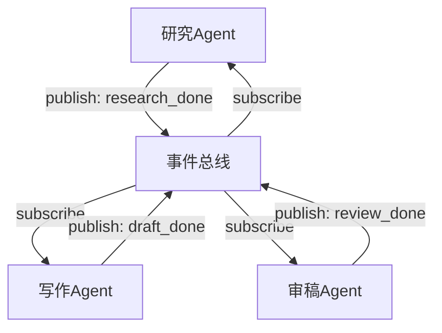
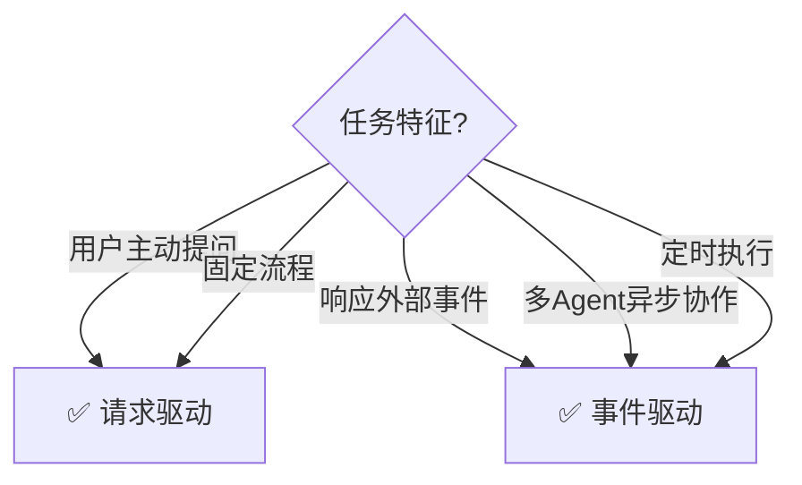

# 事件驱动架构图解

> 用图解理解事件驱动 Agent 的工作方式和与传统模式的区别。

---

## 一、两种模式对比

```mermaid
graph TB
    subgraph 请求响应 {"请求-响应（传统）"}
        U1["用户→Agent→回答"] --> N1["被动等待<br/>一问一答"]
    end

    subgraph 事件驱动 {"事件驱动"}
        E1["事件源"] --> Q["事件队列"]
        Q --> A1["Agent处理"]
        A1 --> E2["产生新事件"]
        E2 --> Q
        N2["主动响应<br/>异步+多源+Agent通信"]
    end

    style 请求响应 fill:'#E3F2FD'
    style 事件驱动 fill:'#C8E6C9'
```

## 二、事件类型

```mermaid
graph TB
    subgraph 事件源 {"Agent可响应的六种事件"}
        E1["👤 用户消息"]
        E2["⏰ 定时器"]
        E3["📁 文件变更"]
        E4["🔗 Webhook"]
        E5["🤖 Agent事件"]
        E6["📊 数据变更"]
    end

    style 事件源 fill:'#E3F2FD'
```

## 三、事件总线

```mermaid
graph TB
    subgraph 总线 {"发布-订阅事件总线"}
        P1["发布者A"] --> BUS["事件总线"]
        P2["发布者B"] --> BUS
        BUS --> S1["订阅者1"]
        BUS --> S2["订阅者2"]
        BUS --> S3["订阅者3"]
    end

    style BUS fill:'#FFF9C4'
```

## 四、多Agent事件通信



## 五、选型决策


