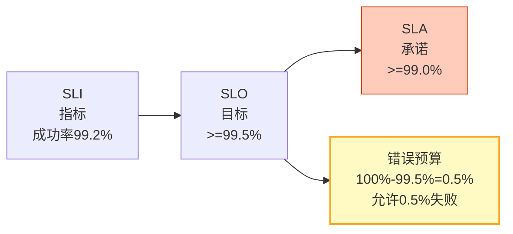
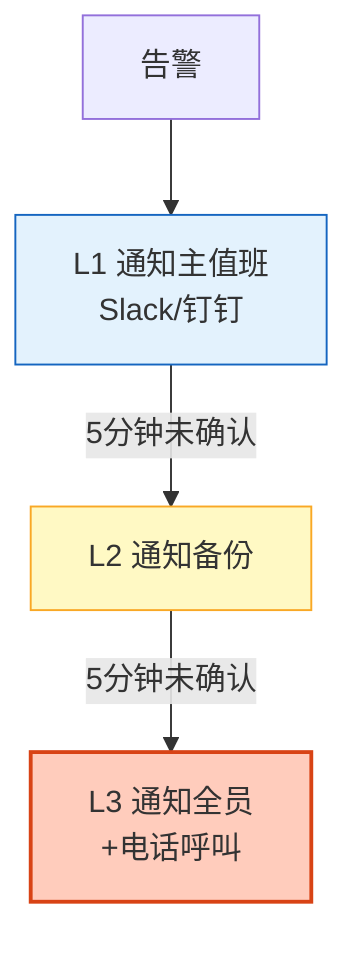

# Agent SRE 与 On-Call 事件管理图解

> SLI/SLO/错误预算+On-Call排班+事件生命周期。本图解可视化SRE体系。

---

## SLI/SLO/SLA



---

## 事件生命周期

```mermaid
graph LR
    D["检测"] --> A["确认"] --> T["分诊"] --> I["调查"]
    I --> M["缓解"] --> R["解决"] --> P["复盘"]

    style D fill:#FFCCBC,stroke:#D84315
    style M fill:#FFF9C4,stroke:#F9A825,stroke-width=2px
    style P fill:#C8E6C9,stroke:#2E7D32,stroke-width=2px
```

---

## On-Call升级



---

## 检查清单

| 检查项 | 状态 |
|--------|------|
| SLI/SLO定义 | ☐ |
| 错误预算 | ☐ |
| On-Call排班 | ☐ |
| 告警升级 | ☐ |
| 事件管理流程 | ☐ |
| 复盘报告 | ☐ |
| Runbook自动化 | ☐ |
