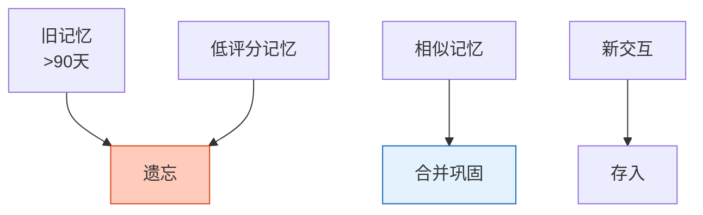

# Agent 情景记忆与语义记忆深度图解

> 情景记忆存事件、语义记忆存偏好。本图解可视化两种记忆和巩固流程。

---

## 两种记忆

```mermaid
graph TB
    MEM["长期记忆"]

    MEM --> EP["情景记忆<br/>具体事件<br/>'上次问了RAG'<br/>向量检索"]
    MEM --> SEM["语义记忆<br/>抽象事实<br/>'偏好中文回答'<br/>KV Store"]

    EP -->|"巩固提取"| SEM

    style MEM fill:#E3F2FD,stroke:#1565C0,stroke-width=3px
    style EP fill:#C8E6C9,stroke:#2E7D32,stroke-width=2px
    style SEM fill:#FFF9C4,stroke:#F9A825,stroke-width=2px
```

---

## 记忆在对话中的作用

```mermaid
graph TB
    Q["用户提问"] --> RECALL["回忆历史<br/>(情景记忆)"]
    RECALL --> FACTS["获取偏好<br/>(语义记忆)"]
    FACTS --> PROMPT["构建增强Prompt"]
    PROMPT --> LLM["LLM回答"]
    LLM --> STORE["存入情景记忆"]
    STORE --> EXTRACT["定期提取偏好<br/>(→语义记忆)"]

    style RECALL fill:#C8E6C9,stroke:#2E7D32,stroke-width=2px
    style STORE fill:#FFF9C4,stroke:#F9A825
```

---

## 记忆遗忘与巩固



---

## 检查清单

| 检查项 | 状态 |
|--------|------|
| 情景vs语义 | ☐ |
| 情景记忆实现 | ☐ |
| 语义记忆实现 | ☐ |
| 偏好提取 | ☐ |
| 记忆巩固 | ☐ |
| 记忆遗忘 | ☐ |
