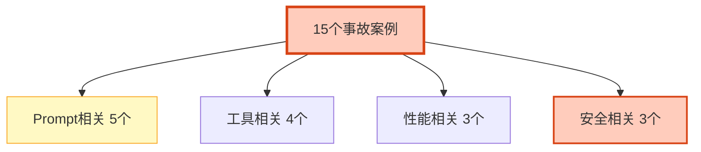

# Agent 踩坑实录与生产事故案例分析图解

> 15个真实事故案例。本图解可视化事故分类和预防要点。

---

## 事故分类

---

## 典型事故

| 案例 | 严重度 | 根因 | 预防 |
|------|--------|------|------|
| Prompt泄露 | 高 | 无输出过滤 | 输出护栏 |
| Few-shot污染 | 中 | 示例未审核 | 质量基线 |
| 温度过高 | 中 | 开发配置上线 | 环境隔离 |
| Token爆炸 | 高 | 无上下文管理 | 窗口管理 |
| 工具结果过大 | 高 | 无截断 | 结果限制 |
| 工具参数注入 | 极高 | 无沙箱 | Schema验证 |
| 工具循环 | 高 | 无迭代限制 | recursion_limit |
| 冷启动失败 | 中 | 探针太早 | startupProbe |
| API限流 | 高 | 无限流 | 令牌桶 |
| 内存泄漏 | 中 | 消息不清理 | 最大限制 |
| 间接注入 | 极高 | 检索无过滤 | 安全检查 |
| 数据泄露 | 极高 | 无用户隔离 | user_id filter |
| 成本失控 | 高 | 无预算 | 日预算+告警 |

---

## 检查清单

| 检查项 | 状态 |
|--------|------|
| Prompt相关5个案例 | ☐ |
| 工具相关4个案例 | ☐ |
| 性能相关3个案例 | ☐ |
| 安全相关3个案例 | ☐ |
| 事故复盘模板 | ☐ |
