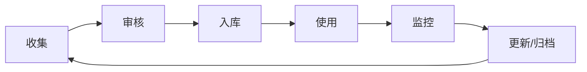
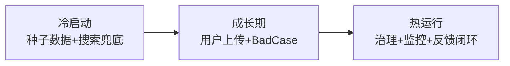

# 数据治理图解

> 用图解理解 RAG 知识库的数据治理框架。

---

## 一、治理五维度

```mermaid
graph TB
    subgraph 五维 {"RAG数据治理五维度"}
        D1["📐 质量<br/>准确/完整/无冗余"]
        D2["🔄 时效<br/>更新/清理/新鲜度"]
        D3["🏷️ 目录<br/>分类/标签/可检索"]
        D4["👤 权限<br/>谁可以看什么"]
        D5["📋 审计<br/>谁改了什么/何时"]
    end

    style 五维 fill:'#E3F2FD'
```

## 二、数据生命周期



## 三、数据目录结构

```mermaid
graph TB
    subgraph 目录 {"数据目录结构"}
        R["知识库根目录"]
        R --> CAT1["分类: 产品文档"]
        R --> CAT2["分类: FAQ"]
        R --> CAT3["分类: 技术文档"]
        CAT1 --> D1["产品手册.pdf"]
        CAT1 --> D2["规格说明.md"]
        CAT2 --> D3["常见问题.md"]
        CAT3 --> D4["API文档.txt"]
    end

    style 目录 fill:'#E3F2FD'
```

## 四、治理流程

```mermaid
graph TB
    subgraph 周循环 {"数据治理周循环"}
        W1["周一: 质量报告"]
        W1 --> W2["周二: 清理过时"]
        W2 --> W3["周三-四: 更新文档"]
        W3 --> W4["周五: 效果评估"]
        W4 --> W1
    end

    style W1 fill:'#E3F2FD'
    style W4 fill:'#C8E6C9'
```

## 五、冷启动到热运行


