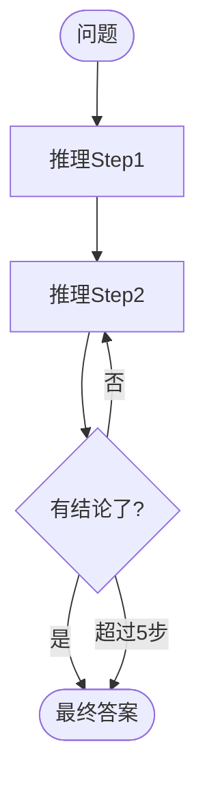
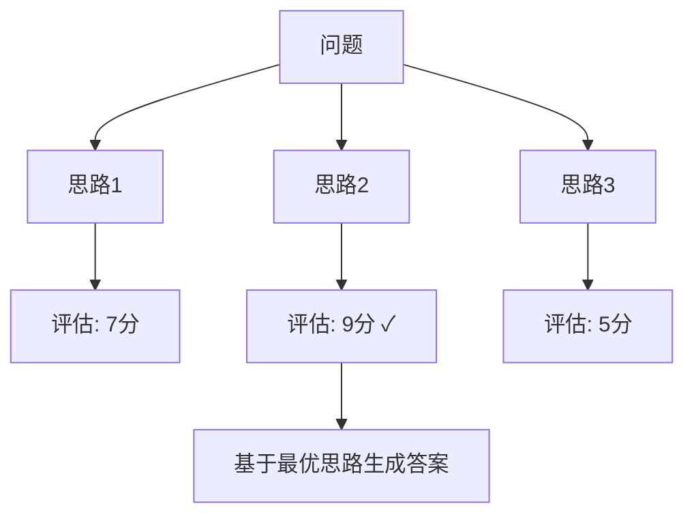
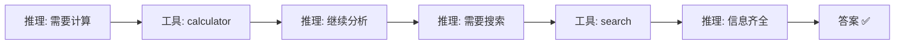
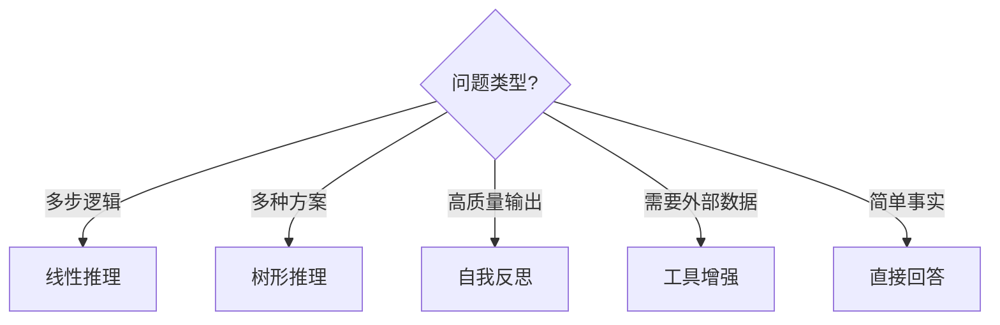

# Agent 推理链图解

> 用图解理解推理链的模式和实现方式。

---

## 一、直接回答 vs 推理链

```mermaid
graph TB
    subgraph 直接 {"❌ 直接回答"}
        U1["问题"] --> L1["LLM直接回答"]
        L1 --> A1["可能出错"]
    end

    subgraph 推理链 {"✅ 推理链"}
        U2["问题"] --> S1["Step1推理"]
        S1 --> S2["Step2推理"]
        S2 --> S3["Step3推理"]
        S3 --> A2["正确答案"]
    end

    style 直接 fill:'#FFCDD2'
    style 推理链 fill:'#C8E6C9'
```

## 二、四种推理模式

```mermaid
graph TB
    subgraph 四种模式 {"推理链四种模式"}
        M1["1.线性推理<br/>Step→Step→Step→答案"]
        M2["2.树形推理<br/>多分支→评估→选最优"]
        M3["3.自我反思<br/>生成→评价→改进"]
        M4["4.工具增强<br/>推理+工具交替"]
    end

    style M1 fill:'#C8E6C9'
    style M2 fill:'#E3F2FD'
    style M3 fill:'#FFF9C4'
    style M4 fill:'#F3E5F5'
```

## 三、线性推理链流程



## 四、树形推理



## 五、工具增强推理



## 六、模式选择


