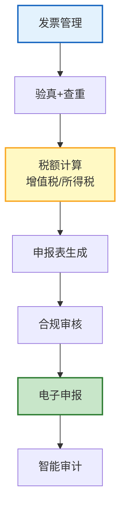

# Agent 税务申报与智能审计图解

> 发票→计算→申报→审计。本图解可视化税务 Agent。

---

## 税务流程

---

## 检查清单

| 检查项 | 状态 |
|--------|------|
| 发票解析 | ☐ |
| 验真+查重 | ☐ |
| 增值税计算 | ☐ |
| 申报表生成 | ☐ |
| 合规检查 | ☐ |
| 智能审计 | ☐ |
| 税务优化 | ☐ |
