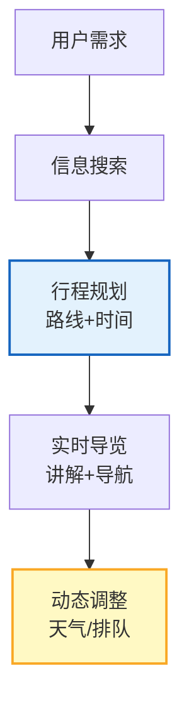

# Agent 旅游规划与智能出行图解

> 行程规划→预订→导览→突发应对。本图解可视化旅游 Agent。

---

```mermaid
graph TB
    REQ["用户需求"] --> SEARCH["信息搜索"]
    SEARCH --> PLAN["行程规划<br/>路线+时间"]
    PLAN --> GUIDE["实时导览<br/>讲解+导航"]
    GUIDE --> ADAPT["动态调整<br/>天气/排队"]

    style PLAN fill:#E3F2FD,stroke:#1565C0,stroke-width:2px
    style ADAPT fill:#FFF9C4,stroke:#F9A825,stroke-width:2px
```

---

## 检查清单

| 检查项 | 状态 |
|--------|------|
| 行程规划 | ☐ |
| 路线优化 | ☐ |
| 实时讲解 | ☐ |
| 天气调整 | ☐ |
| 突发应对 | ☐ |
