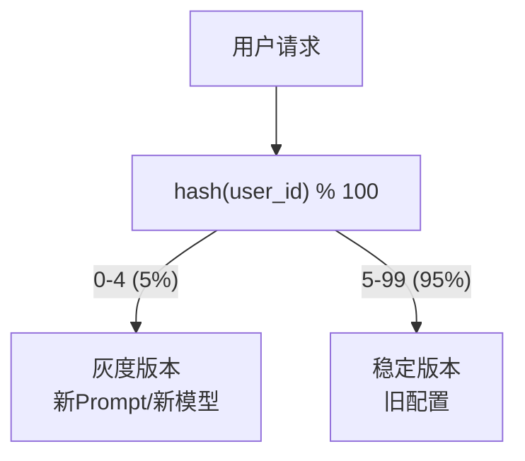
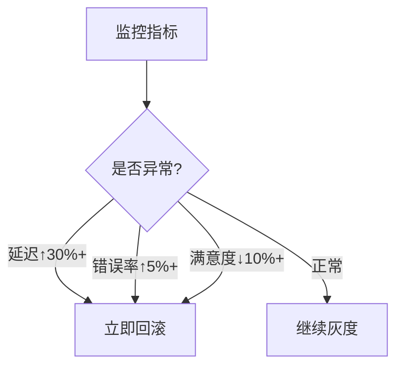

# 灰度发布图解

> 用图解理解 LLM 应用的灰度发布流程和回滚策略。

---

## 一、灰度发布流程

```mermaid
graph LR
    subgraph 灰度 {"灰度发布流程"}
        S1["新版本上线<br/>5%用户"] --> S2{"监控正常?"}
        S2 -->|"是"| S3["扩大到20%"]
        S3 --> S4{"监控正常?"}
        S4 -->|"是"| S5["扩大到50%"]
        S5 --> S6{"监控正常?"}
        S6 -->|"是"| S7["全量100% ✅"]
        S2 -->|"否"| ROLL["回滚到稳定版"]
        S4 -->|"否"| ROLL
        S6 -->|"否"| ROLL
    end

    style S7 fill:'#C8E6C9'
    style ROLL fill:'#FFCDD2'
```

## 二、版本三维度

```mermaid
graph TB
    subgraph 三维 {"LLM应用版本三维度"}
        V1["代码版本<br/>(git管理)"]
        V2["Prompt版本<br/>(注册表管理)"]
        V3["数据版本<br/>(向量库版本)"]
    end

    style 三维 fill:'#E3F2FD'
```

## 三、用户分流



## 四、回滚决策



## 五、检查清单

| 步骤 | 检查项 | 状态 |
|------|--------|------|
| 发布前 | 测试通过 | ☐ |
| 发布前 | 监控就位 | ☐ |
| 灰度 | 5%流量 | ☐ |
| 观察 | 延迟正常 | ☐ |
| 观察 | 错误率正常 | ☐ |
| 扩大 | 逐步到100% | ☐ |
| 完成 | 归档旧版本 | ☐ |
