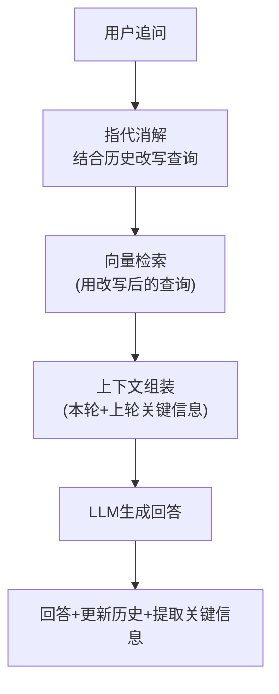
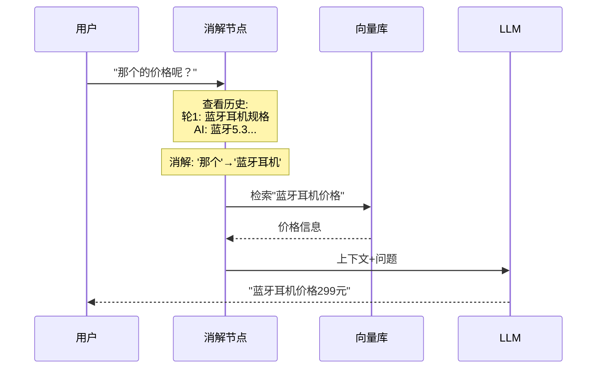

# RAG 多轮对话图解

> 用图解理解多轮 RAG 中的指代消解和上下文传递。

---

## 一、问题：多轮 RAG 中的指代

```mermaid
graph TB
    subgraph 问题 {"多轮RAG指代问题"}
        R1["轮1: '蓝牙耳机规格?'<br/>→检索'蓝牙耳机规格'→回答"]
        R2["轮2: '那个价格呢?'<br/>→❌直接检索'那个价格'→检索不到"]
        R3["轮2(正确): 消解'那个'=蓝牙耳机<br/>→检索'蓝牙耳机价格'→✅回答"]
    end

    style R2 fill:'#FFCDD2'
    style R3 fill:'#C8E6C9'
```

## 二、多轮 RAG 架构



## 三、指代消解流程



## 四、三种检索策略对比

```mermaid
graph TB
    subgraph 策略 {"三种多轮RAG策略"}
        S1["1.直接检索<br/>'那个价格'→检索<br/>❌ 检索不到"]
        S2["2.消解后检索<br/>'蓝牙耳机价格'→检索<br/>✅ 准确(多1次LLM)"]
        S3["3.上下文拼接<br/>'蓝牙耳机 规格'+'价格'→检索<br/>✅ 省1次LLM"]
    end

    style S1 fill:'#FFCDD2'
    style S2 fill:'#C8E6C9'
    style S3 fill:'#E3F2FD'
```

## 五、选型

| 场景 | 策略 | 原因 |
|------|------|------|
| 简单FAQ | 直接检索 | 无指代 |
| 追问频繁 | 消解后检索 | 准确 |
| 追问简单 | 上下文拼接 | 省LLM |
| 长对话 | 消解+截断 | 防溢出 |
