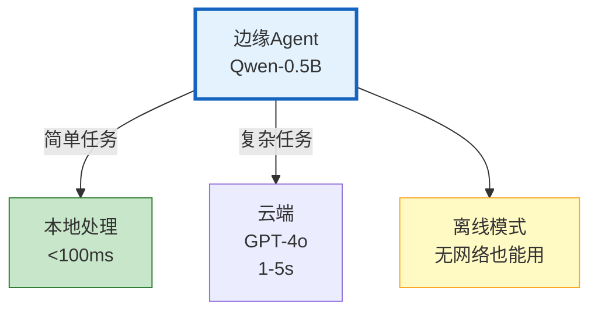

# Agent 边缘计算与端侧部署深度图解

> 云边协同+端侧推理+离线模式。本图解可视化边缘 Agent。

---

```mermaid
graph TB
    EDGE["边缘Agent<br/>Qwen-0.5B"] -->|"简单任务"| LOCAL["本地处理<br/><100ms"]
    EDGE -->|"复杂任务"| CLOUD["云端<br/>GPT-4o<br/>1-5s"]
    EDGE --> OFFLINE["离线模式<br/>无网络也能用"]

    style EDGE fill:#E3F2FD,stroke:#1565C0,stroke-width:3px
    style LOCAL fill:#C8E6C9,stroke:#2E7D32
    style OFFLINE fill:#FFF9C4,stroke:#F9A825
```

---

## 检查清单

| 检查项 | 状态 |
|--------|------|
| 云边协同 | ☐ |
| 智能路由 | ☐ |
| 离线模式 | ☐ |
| 设备适配 | ☐ |
