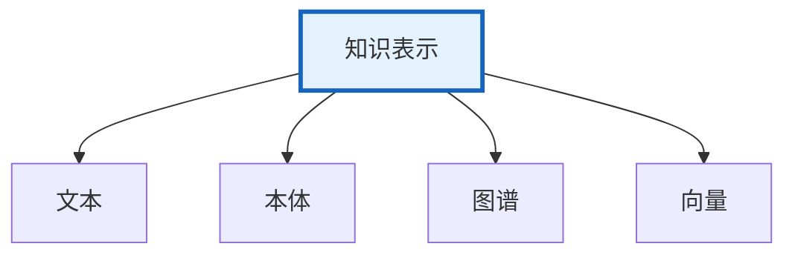

# Agent 知识表示与本体建模图解

```mermaid
graph TB
    KR["知识表示"]
    KR --> T["文本"]
    KR --> O["本体"]
    KR --> G["图谱"]
    KR --> V["向量"]
    style KR fill:#E3F2FD,stroke:#1565C0,stroke-width:3px
```

## 检查清单
| 检查项 | 状态 |
|--------|------|
| 四种表示 | ☐ |
| 本体构建 | ☐ |
| 本体验证 | ☐ |
