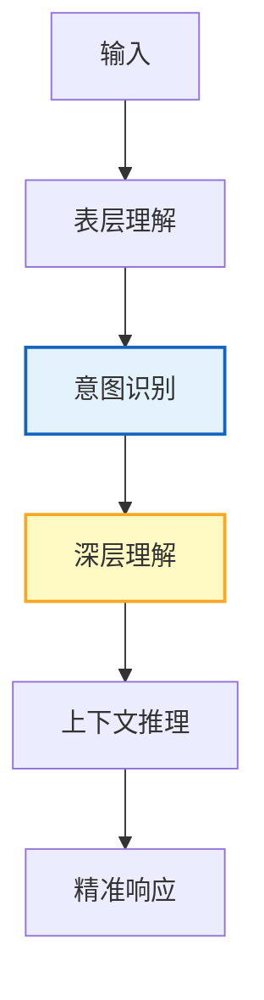

# Agent 语义理解与意图深层解析图解

```mermaid
graph TB
    I["输入"] --> L1["表层理解"]
    L1 --> L2["意图识别"]
    L2 --> L3["深层理解"]
    L3 --> L4["上下文推理"]
    L4 --> O["精准响应"]
    style L2 fill:#E3F2FD,stroke:#1565C0,stroke-width:2px
    style L3 fill:#FFF9C4,stroke:#F9A825,stroke-width:2px
```

## 检查清单
| 检查项 | 状态 |
|--------|------|
| 四层解析 | ☐ |
| 深层意图 | ☐ |
| 歧义检测 | ☐ |
