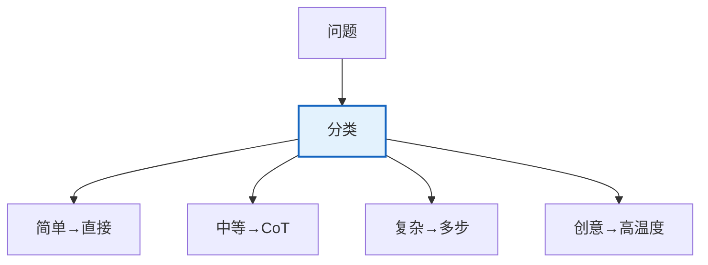

# Agent 自适应推理与动态策略选择图解

```mermaid
graph TB
    Q["问题"] --> C["分类"]
    C --> S["简单→直接"]
    C --> M["中等→CoT"]
    C --> X["复杂→多步"]
    C --> CR["创意→高温度"]
    style C fill:#E3F2FD,stroke:#1565C0,stroke-width:2px
```

## 检查清单
| 检查项 | 状态 |
|--------|------|
| 动态路由 | ☐ |
| 推理深度 | ☐ |
| 成本优化 | ☐ |
