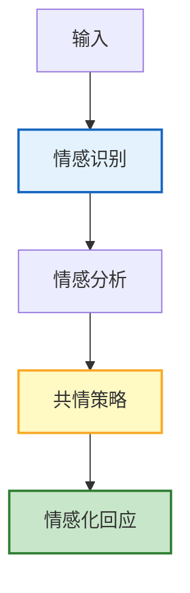

# Agent 多模态情感计算与共情能力图解

```mermaid
graph TB
    I["输入"] --> D["情感识别"]
    D --> A["情感分析"]
    A --> S["共情策略"]
    S --> G["情感化回应"]
    style D fill:#E3F2FD,stroke:#1565C0,stroke-width:2px
    style S fill:#FFF9C4,stroke:#F9A825,stroke-width:2px
    style G fill:#C8E6C9,stroke:#2E7D32,stroke-width:2px
```

## 检查清单
| 检查项 | 状态 |
|--------|------|
| 情感识别 | ☐ |
| 共情策略 | ☐ |
| 情感回应 | ☐ |
