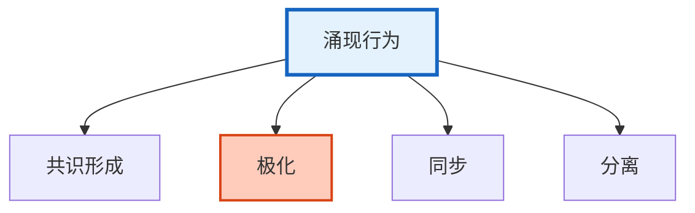

# Agent 群体涌现行为与复杂性管理图解

```mermaid
graph TB
    E["涌现行为"]
    E --> C["共识形成"]
    E --> P["极化"]
    E --> S["同步"]
    E --> SE["分离"]
    style E fill:#E3F2FD,stroke:#1565C0,stroke-width:3px
    style P fill:#FFCCBC,stroke:#D84315,stroke-width:2px
```

## 检查清单
| 检查项 | 状态 |
|--------|------|
| 四种涌现 | ☐ |
| 涌现检测 | ☐ |
| 复杂性管理 | ☐ |
