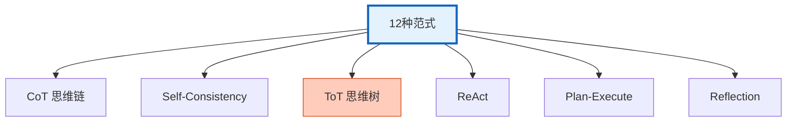

# Agent 提示工程高级模式与范式图解

```mermaid
graph TB
    P["12种范式"]
    P --> C["CoT 思维链"]
    P --> S["Self-Consistency"]
    P --> T["ToT 思维树"]
    P --> R["ReAct"]
    P --> PE["Plan-Execute"]
    P --> RF["Reflection"]
    style P fill:#E3F2FD,stroke:#1565C0,stroke-width:3px
    style T fill:#FFCCBC,stroke:#D84315
```

## 检查清单
| 检查项 | 状态 |
|--------|------|
| 12种范式 | ☐ |
| 效果对比 | ☐ |
| 范式选择 | ☐ |
| 组合策略 | ☐ |
