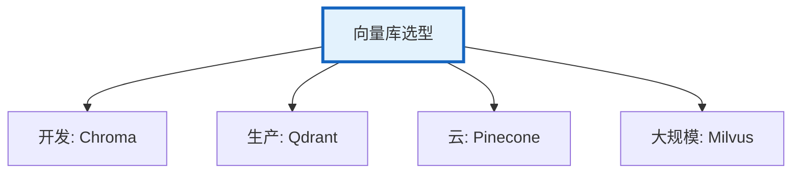

# Agent 向量数据库选型与性能调优深度图解

```mermaid
graph TB
    V["向量库选型"]
    V --> DEV["开发: Chroma"]
    V --> PROD["生产: Qdrant"]
    V --> CLOUD["云: Pinecone"]
    V --> BIG["大规模: Milvus"]
    style V fill:#E3F2FD,stroke:#1565C0,stroke-width:3px
```

## 检查清单
| 检查项 | 状态 |
|--------|------|
| 8大向量库 | ☐ |
| HNSW调优 | ☐ |
| 分片策略 | ☐ |
| 性能基准 | ☐ |
