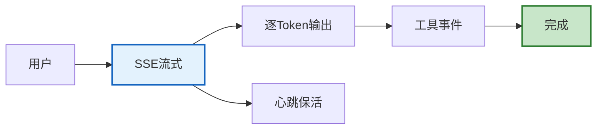

# Agent 流式架构与实时通信工程化图解

```mermaid
graph LR
    Q["用户"] --> SSE["SSE流式"]
    SSE --> T["逐Token输出"]
    T --> TOOL["工具事件"]
    TOOL --> DONE["完成"]
    SSE --> HB["心跳保活"]
    style SSE fill:#E3F2FD,stroke:#1565C0,stroke-width:2px
    style DONE fill:#C8E6C9,stroke:#2E7D32,stroke-width:2px
```

## 检查清单
| 检查项 | 状态 |
|--------|------|
| SSE流式 | ☐ |
| 工具事件 | ☐ |
| 心跳保活 | ☐ |
| 中断恢复 | ☐ |
