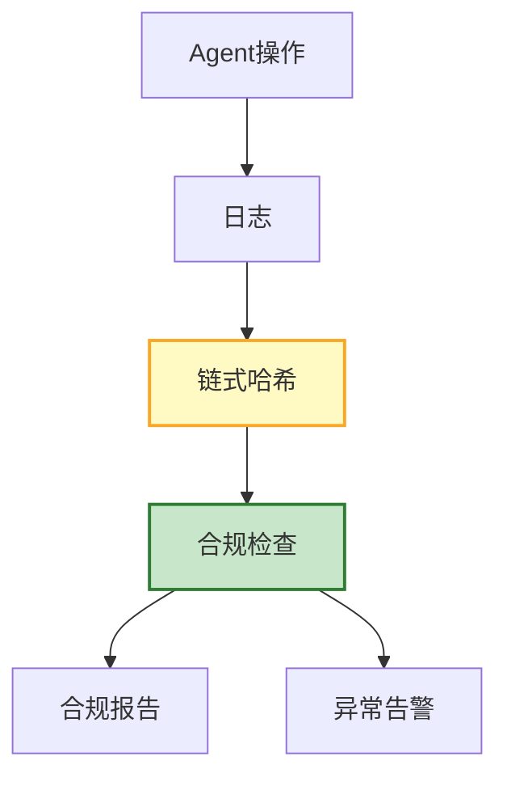

# Agent 安全审计与合规自动化图解

```mermaid
graph TB
    A["Agent操作"] --> L["日志"]
    L --> H["链式哈希"]
    H --> C["合规检查"]
    C --> R["合规报告"]
    C --> AL["异常告警"]
    style H fill:#FFF9C4,stroke:#F9A825,stroke-width:2px
    style C fill:#C8E6C9,stroke:#2E7D32,stroke-width:2px
```

## 检查清单
| 检查项 | 状态 |
|--------|------|
| 链式哈希 | ☐ |
| 链验证 | ☐ |
| 合规检查 | ☐ |
| 合规报告 | ☐ |
