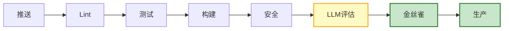

# Agent 持续集成与自动化部署流水线图解

```mermaid
graph LR
    P["推送"] --> L["Lint"] --> T["测试"] --> B["构建"] --> S["安全"]
    S --> E["LLM评估"] --> C["金丝雀"] --> D["生产"]
    style E fill:#FFF9C4,stroke:#F9A825,stroke-width:2px
    style C fill:#C8E6C9,stroke:#2E7D32,stroke-width:2px
    style D fill:#C8E6C9,stroke:#2E7D32,stroke-width:2px
```

## 检查清单
| 检查项 | 状态 |
|--------|------|
| CI/CD流水线 | ☐ |
| LLM评估 | ☐ |
| 金丝雀发布 | ☐ |
| 自动回滚 | ☐ |
