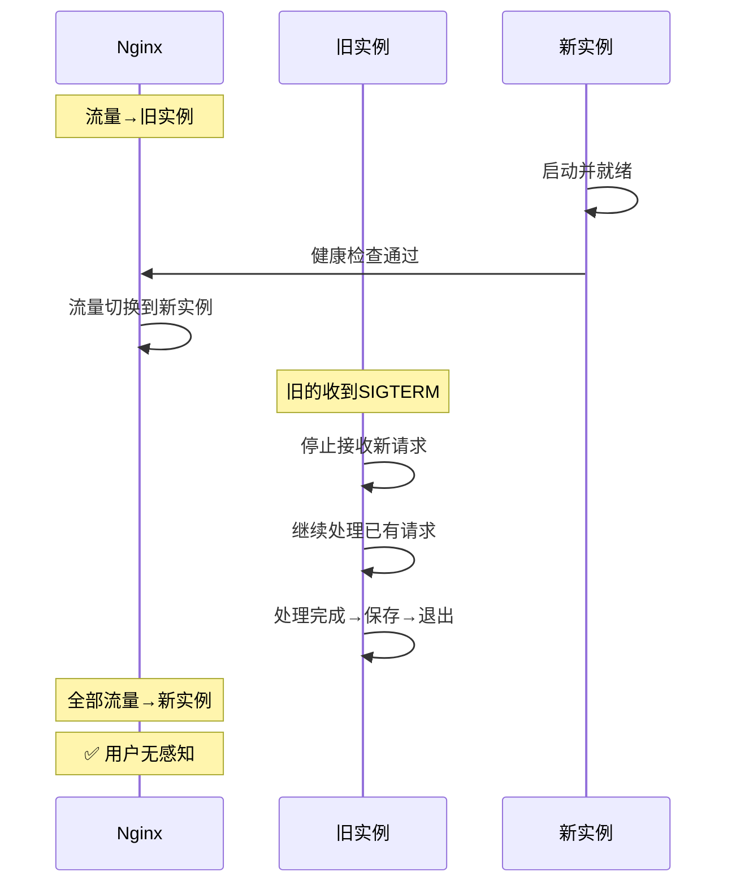
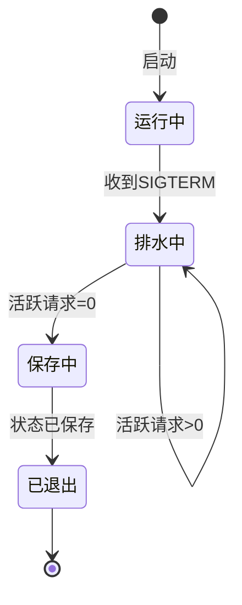

# 优雅关闭图解

> 用图解理解 LLM 应用的优雅关闭和零停机重启流程。

---

## 一、强制 vs 优雅关闭

```mermaid
graph TB
    subgraph 强制 {"❌ 强制kill"}
        K1["kill -9"] --> K2["请求中断"]
        K2 --> K3["用户500错误"]
        K3 --> K4["数据损坏"]
    end

    subgraph 优雅 {"✅ 优雅关闭"}
        G1["SIGTERM"] --> G2["停止新请求"]
        G2 --> G3["等待活跃请求完成"]
        G3 --> G4["保存状态→退出"]
    end

    style 强制 fill:'#FFCDD2'
    style 优雅 fill:'#C8E6C9'
```

## 二、零停机重启



## 三、关闭状态流转



## 四、检查清单

| 检查项 | 状态 |
|--------|------|
| SIGTERM处理 | ☐ |
| 请求排水 | ☐ |
| /health返回draining | ☐ |
| Nginx流量切换 | ☐ |
| 状态保存 | ☐ |
| 超时退出(60s) | ☐ |
