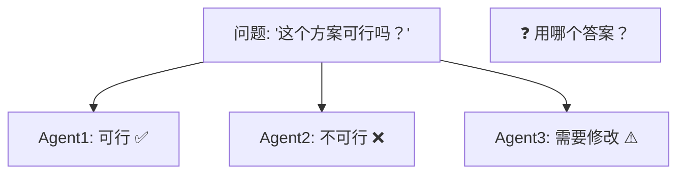
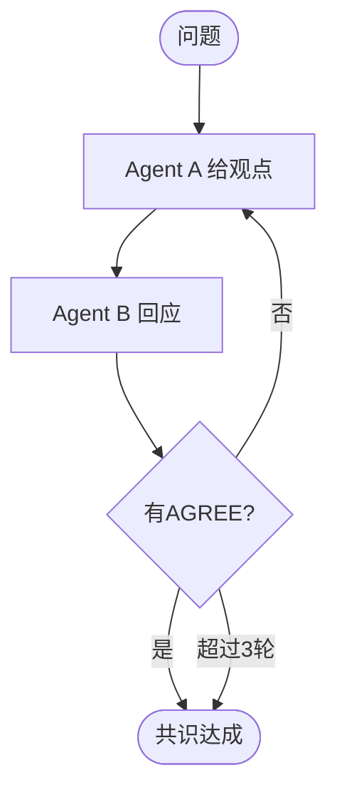
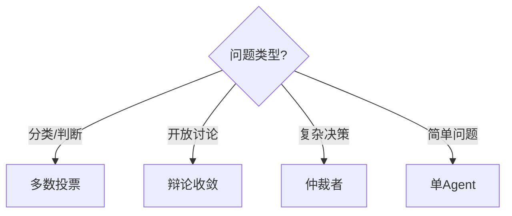

# 共识机制图解

> 用图解理解多 Agent 共识的三种机制。

---

## 一、问题：多 Agent 不一致



## 二、三种共识机制

```mermaid
graph TB
    subgraph 多数投票 {"1.多数投票"}
        V1["3个Agent独立回答"] --> V2["多数表决"]
        V2 --> V3["取多数答案 ✅"]
    end

    subgraph 辩论收敛 {"2.辩论收敛"}
        D1["A给观点"] --> D2["B回应/反驳"]
        D2 --> D3{"达成一致?"}
        D3 -->|"否"| D1
        D3 -->|"是"| D4["收敛答案 ✅"]
    end

    subgraph 仲裁者 {"3.仲裁者"}
        AR1["多Agent给意见"] --> AR2["独立仲裁者综合"]
        AR2 --> AR3["最终答案 ✅"]
    end

    style 多数投票 fill:'#C8E6C9'
    style 辩论收敛 fill:'#E3F2FD'
    style 仲裁者 fill:'#F3E5F5'
```

## 三、辩论收敛流程



## 四、选型



## 五、成本对比

| 机制 | LLM调用 | 准确率提升 | 适用 |
|------|---------|-----------|------|
| 多数投票 | N次 | +10-25% | 分类/判断 |
| 辩论收敛 | 2N次 | +20% | 开放问题 |
| 仲裁者 | N+1次 | +25% | 复杂决策 |
