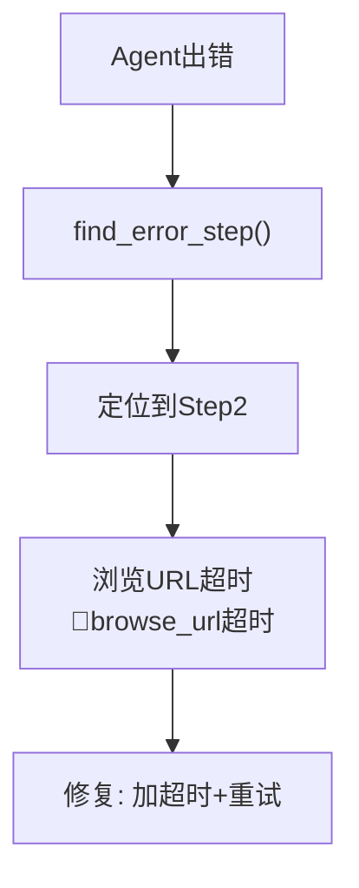
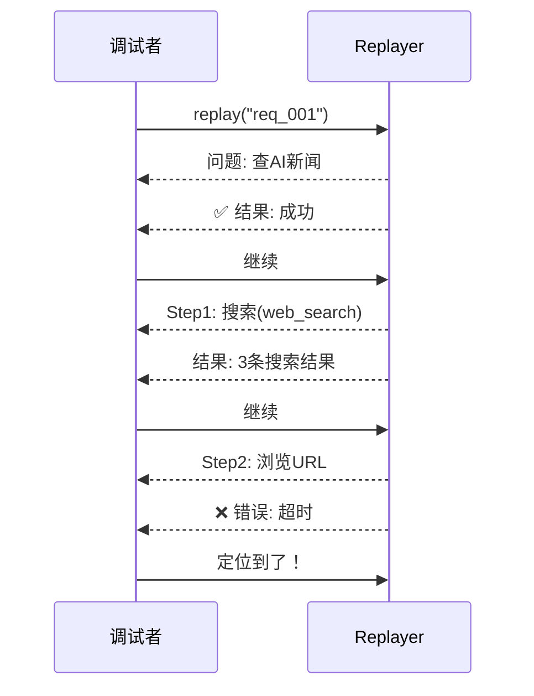

# 决策回放图解

> 用图解理解 Agent 决策回放和调试流程。

---

## 一、决策记录到回放

```mermaid
graph LR
    subgraph 记录到回放 {"决策记录→存储→回放"}
        R["Agent执行<br/>RecordingCallback记录"] --> S["保存到文件<br/>req_001.json"]
        S --> P["DecisionReplayer<br/>回放决策链"]
    end

    style R fill:'#E3F2FD'
    style P fill:'#C8E6C9'
```

## 二、决策链结构

```mermaid
graph TB
    subgraph 决策链 {"一次请求的决策链"}
        S1["Step1: 搜索<br/>🔧web_search('AI新闻')<br/>👀搜索结果<br/>⏱️800ms"]
        S2["Step2: 浏览<br/>🔧browse_url(url)<br/>👀网页内容<br/>⏱️1200ms"]
        S3["Step3: 生成<br/>🧠LLM回答<br/>⏱️2800ms"]
        S4["最终回答<br/>总耗时: 4800ms"]
        S1 --> S2 --> S3 --> S4
    end

    style 决策链 fill:'#E3F2FD'
```

## 三、错误定位



## 四、逐步回放


