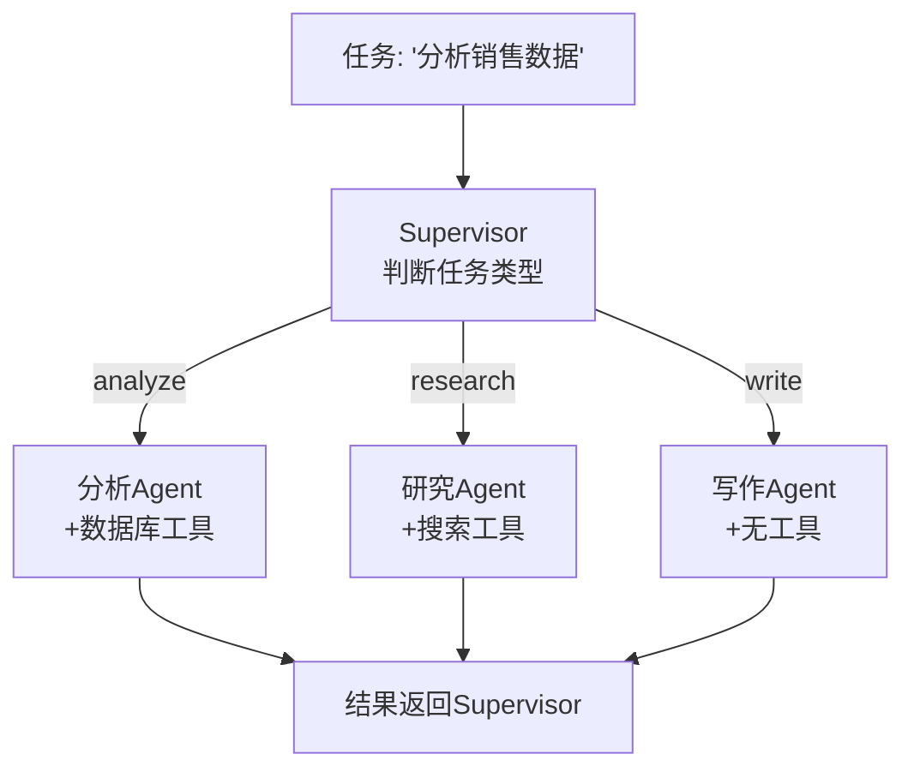
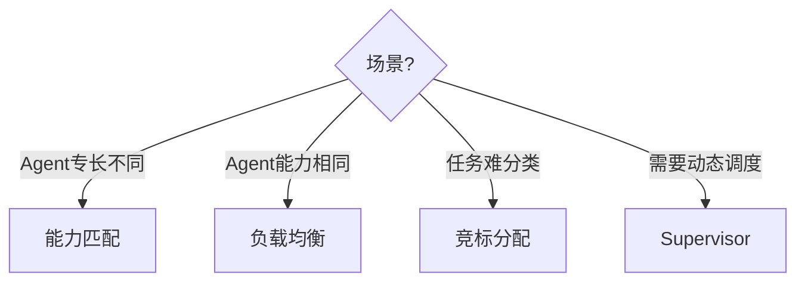

# 多 Agent 任务分配图解

> 用图解理解多 Agent 系统的任务分配策略。

---

## 一、任务分配的挑战

```mermaid
graph TB
    subgraph 挑战 {"任务分配四问"}
        Q1["谁来做？→ 能力匹配"]
        Q2["做多少？→ 负载均衡"]
        Q3["何时做？→ 依赖排序"]
        Q4["做不好？→ 重新分配"]
    end

    style 挑战 fill:'#E3F2FD'
```

## 二、三种分配策略

```mermaid
graph TB
    subgraph 策略 {"三种任务分配策略"}
        S1["能力匹配<br/>按专长分配<br/>研究→研究员<br/>写作→写手"]
        S2["负载均衡<br/>谁闲谁做<br/>避免过载"]
        S3["竞标分配<br/>Agent自评<br/>最优者获得"]
    end

    style S1 fill:'#C8E6C9'
    style S2 fill:'#E3F2FD'
    style S3 fill:'#F3E5F5'
```

## 三、Supervisor 分配模式



## 四、策略选择


