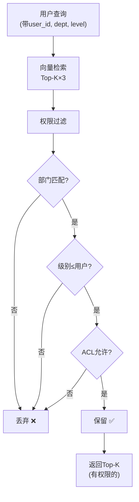

# 文档权限图解

> 用图解理解 RAG 系统中的文档级权限控制。

---

## 一、无权限 vs 有权限

```mermaid
graph TB
    subgraph 无权限 {"❌ 无权限控制"}
        U1["销售部用户"] --> VDB["共享向量库"]
        U2["财务部用户"] --> VDB
        VDB --> R1["都能看到所有文档 ❌"]
    end

    subgraph 有权限 {"✅ 文档级权限"}
        U3["销售部用户"] --> FILTER["权限过滤层"]
        U4["财务部用户"] --> FILTER
        FILTER --> VDB2["向量库"]
        VDB2 --> R2["只返回有权访问的 ✅"]
    end

    style 无权限 fill:'#FFCDD2'
    style 有权限 fill:'#C8E6C9'
```

## 二、权限三个维度

```mermaid
graph TB
    subgraph 三维 {"文档权限三维度"}
        D1["部门权限<br/>sales/finance/tech<br/>只能看本部门"]
        D2["级别权限<br/>public(1)/internal(2)/confidential(3)<br/>只能看≤自己级别"]
        D3["ACL<br/>精确到用户/角色<br/>特定文档特定权限"]
    end

    style 三维 fill:'#E3F2FD'
```

## 三、权限过滤流程



## 四、文档元数据

```mermaid
graph TB
    subgraph 元数据 {"带权限的文档元数据"}
        D["📄 文档块"]
        D --> M1["department: 'sales'"]
        D --> M2["classification: 'internal'"]
        D --> M3["allowed_users: ['user_001']"]
        D --> M4["allowed_roles: ['sales_manager']"]
    end

    style 元数据 fill:'#E3F2FD'
```

## 五、检查清单

| 检查项 | 状态 |
|--------|------|
| 文档带权限元数据 | ☐ |
| 检索结果按权限过滤 | ☐ |
| 部门隔离 | ☐ |
| 级别控制 | ☐ |
| ACL精确控制 | ☐ |
| 缓存Key含权限 | ☐ |
| 审计日志 | ☐ |
