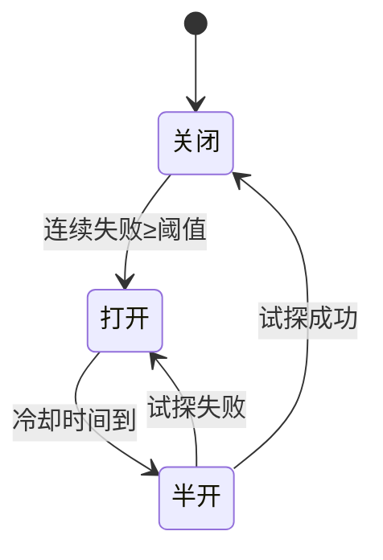

# 断路器模式图解

> 用图解理解断路器的三态转换和工作流程。

---

## 一、断路器价值

```mermaid
graph TB
    subgraph 无断路器 {"❌ 无断路器"}
        U["请求"] --> L["LLM API"]
        L --> F["❌ 失败"]
        F --> R["重试"]
        R --> L
        N["雪崩: 全部超时"]
    end

    subgraph 有断路器 {"✅ 有断路器"}
        U2["请求"] --> CB{"断路器"}
        CB -->|"关闭"| L2["正常调用"]
        CB -->|"打开"| FALL["立即降级"]
        CB -->|"半开"| TRY["试探调用"]
    end

    style 无断路器 fill:'#FFCDD2'
    style 有断路器 fill:'#C8E6C9'
```

## 二、三态转换



## 三、三态行为

```mermaid
graph TB
    subgraph 三态 {"断路器三态"}
        C["🟢 关闭(Closed)<br/>正常调用<br/>记录失败次数"]
        O["🔴 打开(Open)<br/>不调用<br/>立即返回降级"]
        H["🟡 半开(Half-Open)<br/>允许少量试探<br/>成功→关闭/失败→打开"]
    end

    C -->|"连续失败≥5次"| O
    O -->|"冷却60秒"| H
    H -->|"试探成功"| C
    H -->|"试探失败"| O

    style C fill:'#C8E6C9'
    style O fill:'#FFCDD2'
    style H fill:'#FFF9C4'
```

## 四、检查清单

| 检查项 | 状态 |
|--------|------|
| 失败阈值 | ☐ |
| 冷却时间 | ☐ |
| 半开试探 | ☐ |
| 降级响应 | ☐ |
| 状态查询 | ☐ |
