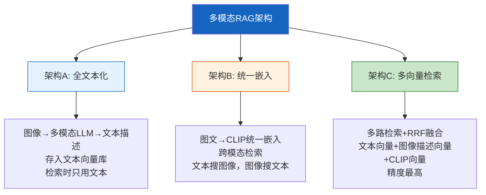
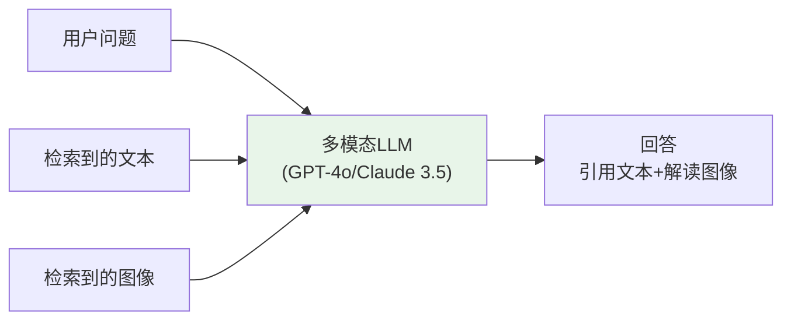
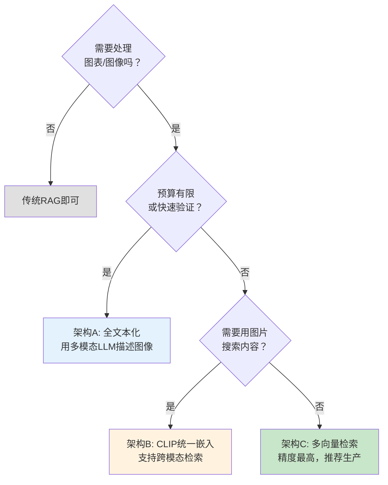

# 多模态 RAG 流程图解

> 用图解理解三种多模态 RAG 架构、跨模态检索原理和多向量融合排序。

---

## 一、传统RAG的局限

```mermaid
graph TB
    subgraph 问题 {"传统RAG只处理文本"}
        D1["PDF文档"] --> D2["文本提取"]
        D2 --> D3["图表/图像被丢弃"]
        D3 --> D4["向量库只有文本"]
        D4 --> D5["❌ 检索不到图表信息"]
    end

    style 问题 fill:#FFCDD2
```

---

## 二、三种架构对比



---

## 三、架构A：全文本化流程

```mermaid
graph LR
    subgraph 离线 {"离线建库"}
        P1["多模态文档"] --> P2["解析: 文本+图像"]
        P2 --> P3["图像→多模态LLM→描述"]
        P3 --> P4["合并: 原文+图像描述"]
        P4 --> P5["分块+嵌入→向量库"]
    end

    subgraph 在线 {"在线检索"}
        Q1["用户问题"] --> Q2["文本检索"]
        Q2 --> Q3["返回含图像描述的文本"]
        Q3 --> Q4["LLM生成"]
    end

    style 离线 fill:#E3F2FD
    style 在线 fill:#FFF3E0
```

---

## 四、架构B：CLIP统一嵌入空间

```mermaid
graph TB
    subgraph 统一空间 {"CLIP统一嵌入"}
        T["文本"] --> TE["CLIP Text Encoder"]
        I["图像"] --> IE["CLIP Image Encoder"]
        TE --> VS["同一512维向量空间"]
        IE --> VS
    end

    subgraph 跨模态检索 {"跨模态搜索"}
        Q["用户文本查询"] --> QE["CLIP Text Encoder"]
        QE --> QV["查询向量"]
        QV --> SEARCH["在统一空间搜索"]
        SEARCH --> R1["匹配到相关文本块"]
        SEARCH --> R2["匹配到相关图像"]
    end

    style 统一空间 fill:#E3F2FD
    style 跨模态检索 fill:#FFF3E0
```

---

## 五、架构C：多向量检索（推荐）

```mermaid
graph TB
    subgraph 离线 {"离线建库（三路索引）"}
        D["文档解析"] --> D1["文本块→文本嵌入"]
        D --> D2["图像→描述→嵌入"]
        D --> D3["图像→CLIP图像嵌入"]
        D1 & D2 & D3 --> D4["多向量存储<br/>关联同一文档ID"]
    end

    subgraph 在线 {"在线三路检索+融合"}
        Q["用户问题"] --> R1["文本向量检索 Top-K"]
        Q --> R2["图像描述向量检索 Top-K"]
        Q --> R3["CLIP向量检索 Top-K"]
        R1 & R2 & R3 --> FUSE["RRF融合排序"]
        FUSE --> GEN["多模态LLM生成<br/>文本+图像→回答"]
    end

    style 离线 fill:#E3F2FD
    style 在线 fill:#FFF3E0
    style FUSE fill:#FFF9C4
    style GEN fill:#C8E6C9
```

---

## 六、RRF融合排序原理

```mermaid
graph TB
    subgraph RRF {"Reciprocal Rank Fusion"}
        L1["文本检索结果<br/>排名: A→B→C→D"]
        L2["图像描述检索<br/>排名: B→A→E→D"]
        L3["CLIP检索<br/>排名: A→E→B→C"]

        L1 & L2 & L3 --> FUSE["按排名倒数加权<br/>score = Σ 1/(60+rank)"]
        FUSE --> R["融合排序: A→B→C→D→E"]
    end

    style FUSE fill:#FFF9C4
    style R fill:#C8E6C9
```

---

## 七、多模态生成



---

## 八、文档解析方案对比

```mermaid
graph TB
    subgraph 解析 {"多模态文档解析方案"}
        S1["Unstructured<br/>通用解析<br/>免费 | 中等精度"]
        S2["PyMuPDF<br/>PDF专用<br/>免费 | 高精度"]
        S3["LlamaParse<br/>商业服务<br/>付费 | 最高精度"]
        S4["LayoutLMv3<br/>自建模型<br/>GPU成本 | 高精度"]
    end

    style 解析 fill:#FFF3E0
```

---

## 九、评估维度

```mermaid
graph TB
    subgraph 评估 {"多模态RAG评估"}
        E1["检索评估<br/>文档召回率<br/>模态覆盖率<br/>跨模态命中率"]
        E2["生成评估<br/>图文引用准确率<br/>图像信息利用率"]
        E3["端到端<br/>多模态问答准确率"]
    end

    style 评估 fill:#E8F5E9
```

---

## 十、选型决策树


