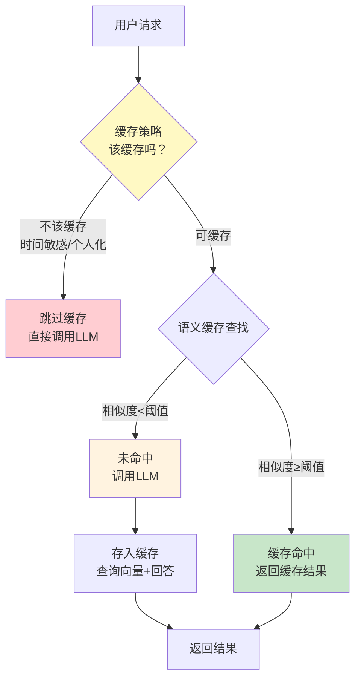
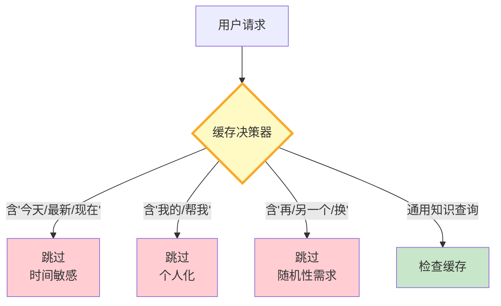
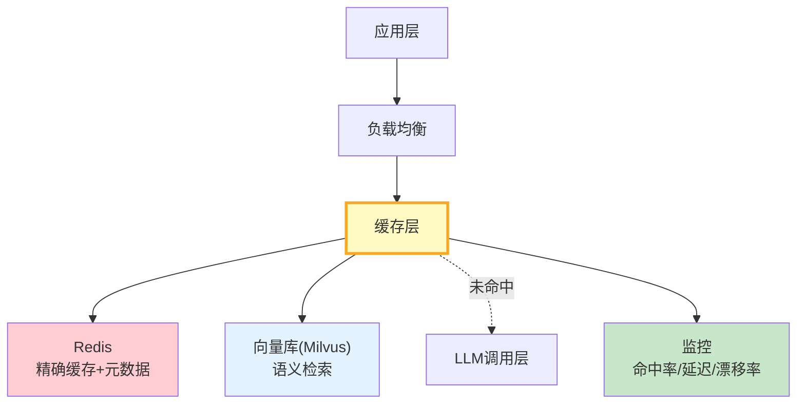

# 语义缓存架构图解

> 用图解理解语义缓存原理、两层缓存架构、失效策略和缓存决策逻辑。

---

## 一、语义缓存 vs 精确缓存

```mermaid
graph TB
    subgraph 精确 {"精确缓存: hash匹配"}
        Q1["'Python列表怎么排序'"] --> H1["hash(查询)"]
        H1 --> M1["❌ 未命中<br/>上次问的是'如何排序列表'"]
    end

    subgraph 语义 {"语义缓存: 向量相似度"}
        Q2["'Python列表怎么排序'"] --> V1["嵌入向量"]
        V1 --> SIM["cosine_sim > 0.92?"]
        SIM --> H2["✅ 命中<br/>语义相同"]
    end

    style 精确 fill:#FFCDD2
    style 语义 fill:#C8E6C9
```

---

## 二、核心流程



---

## 三、两层缓存架构

```mermaid
graph TB
    subgraph 两层 {"两层缓存: 精确 + 语义"}
        L1["第一层: 精确缓存<br/>Redis hash查找<br/>O(1) ~1ms"]
        L2["第二层: 语义缓存<br/>向量库相似度搜索<br/>~5-20ms"]
    end

    Q["查询"] --> L1
    L1 -->|命中| RET["返回"]
    L1 -->|未命中| L2
    L2 -->|命中| RET
    L2 -->|未命中| LLM["调用LLM"]

    style L1 fill:#E3F2FD
    style L2 fill:#FFF3E0
    style RET fill:#C8E6C9
    style LLM fill:#FFCDD2
```

---

## 四、缓存存储结构

```mermaid
graph TB
    subgraph Redis {"Redis存储"}
        R1["cache:exact:{hash}<br/>→ answer (TTL)"]
        R2["cache:answer:{entry_id}<br/>→ answer (TTL)"]
        R3["cache:hits:{entry_id}<br/>→ hit_count"]
    end

    subgraph 向量库 {"向量库存储"}
        V1["查询文本 → 查询向量"]
        V2["metadata: {entry_id}"]
        V3["支持相似度搜索"]
    end

    Redis -->|"entry_id关联"| 向量库

    style Redis fill:#FFCDD2,stroke:#C62828
    style 向量库 fill:#E3F2FD,stroke:#1565C0
```

---

## 五、缓存决策策略



---

## 六、失效策略

```mermaid
graph TB
    subgraph 失效 {"四种失效策略"}
        F1["TTL过期<br/>超时自动失效<br/>默认1小时"]
        F2["LRU淘汰<br/>空间满时删最旧<br/>按时间排序"]
        F3["主动失效<br/>知识更新时<br/>按关键词清除"]
        F4["漂移检测<br/>抽样重新生成<br/>对比新旧答案"]
    end

    style 失效 fill:#FFF3E0
```

---

## 七、答案漂移检测

```mermaid
graph TB
    subgraph 漂移 {"答案漂移检测流程"}
        S1["随机抽样N条缓存"] --> S2["重新调用LLM"]
        S2 --> S3["对比新旧答案"]
        S3 --> S4{"一致？"}
        S4 -->|是| S5["✅ 缓存有效"]
        S4 -->|否| S6["❌ 缓存漂移<br/>清除该条目"]
        S6 --> S7["记录漂移率"]
        S7 --> S8{"漂移率>5%？"}
        S8 -->|是| S9["全局缓存清除<br/>调整TTL"]
        S8 -->|否| S10["继续监控"]
    end

    style S6 fill:#FFCDD2
    style S5 fill:#C8E6C9
    style S9 fill:#FFCDD2
```

---

## 八、生产架构



---

## 九、监控指标

```mermaid
graph TB
    subgraph 监控 {"语义缓存监控指标"}
        M1["命中率<br/>目标: >40%<br/>hit / total"]
        M2["误命中率<br/>目标: <2%<br/>错误命中 / 总命中"]
        M3["缓存延迟<br/>目标: <20ms<br/>向量检索耗时"]
        M4["漂移率<br/>目标: <5%<br/>验证不一致比例"]
        M5["存储效率<br/>节省Token / 存储成本"]
    end

    style 监控 fill:#E3F2FD
```

---

## 十、检查清单

| 检查项 | 状态 |
|--------|------|
| 理解语义缓存原理 | ☐ |
| 配置了合理的相似度阈值 | ☐ |
| 有缓存策略决定哪些可缓存 | ☐ |
| 实现了TTL+LRU失效 | ☐ |
| 有主动失效机制 | ☐ |
| 有漂移检测 | ☐ |
| 监控命中率+误命中率 | ☐ |
