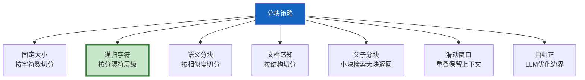
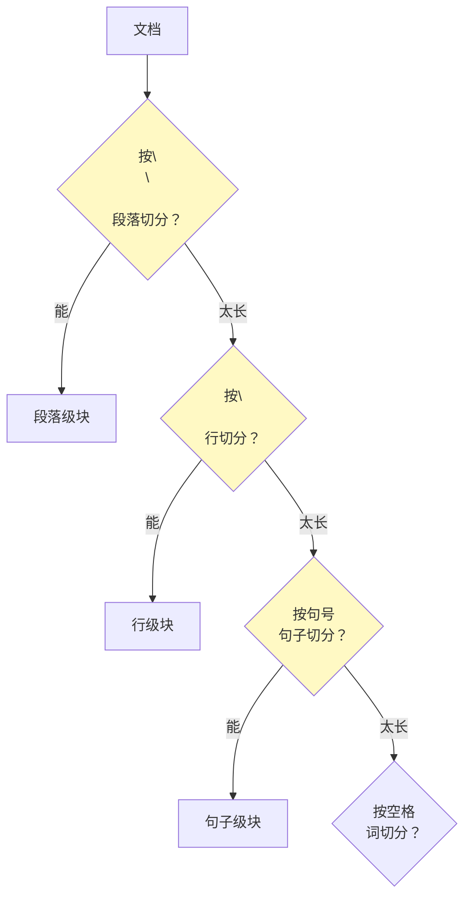
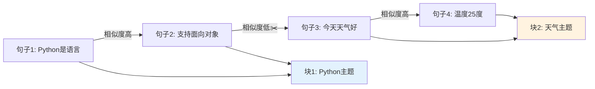
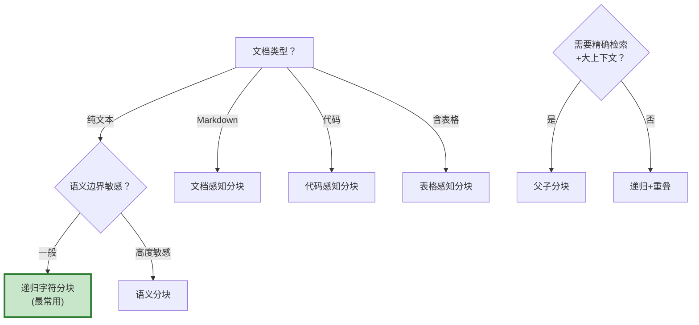

# RAG 分块策略图解

> 用图解理解 7 种分块策略的原理、适用场景和选型决策。

---

## 一、分块为什么重要

```mermaid
graph TB
    subgraph 问题 {"分块不当的后果"}
        TOO_BIG["太大<br/>信号稀释<br/>上下文被无关内容占据"]
        TOO_SMALL["太小<br/>上下文丢失<br/>检索需要更多块"]
        BAD_CUT["截断位置不对<br/>句子/表格被拆散"]
    end

    style TOO_BIG fill:#FFCDD2
    style TOO_SMALL fill:#FFE0B2
    style BAD_CUT fill:#FFCDD2
```

---

## 二、7种策略总览



---

## 三、递归字符分块（最常用）



---

## 四、语义分块



---

## 五、文档感知分块

```mermaid
graph TB
    subgraph Markdown {"按标题层级切分"}
        H1["# 第一章"] --> C1["块1<br/>metadata: H1=第一章"]
        H2["## 1.1 背景"] --> C2["块2<br/>metadata: H1+H2"]
        H3["### 历史"] --> C3["块3<br/>metadata: H1+H2+H3"]
    end

    subgraph 代码 {"按语法结构切分"}
        F1["def func_a():"] --> CF1["块1: 完整函数"]
        F2["class MyClass:"] --> CF2["块2: 完整类"]
    end

    style Markdown fill:#C8E6C9
    style 代码 fill:#E3F2FD
```

---

## 六、父子分块

```mermaid
graph TB
    subgraph 离线 {"离线建库"}
        DOC["文档"] --> PARENT["切大块(父块)<br/>1000字符"]
        PARENT --> CHILD["切小块(子块)<br/>200字符"]
        CHILD --> INDEX["子块→嵌入向量库"]
        PARENT --> STORE["父块→文档库"]
    end

    subgraph 在线 {"在线检索"}
        Q["查询"] --> SEARCH["用子块检索"]
        SEARCH --> MAP["映射到父块"]
        MAP --> RET["返回父块<br/>更大上下文"]
    end

    style 离线 fill:#E3F2FD
    style 在线 fill:#FFF3E0
    style SEARCH fill:#FFF9C4
```

---

## 七、滑动窗口


---

## 八、选型决策树



---

## 九、参数建议

```mermaid
graph TB
    subgraph 参数 {"分块参数建议"}
        P1["块大小: 300-1000字符<br/>太小丢上下文<br/>太大稀释信号"]
        P2["重叠率: 10-20%<br/>防止跨块概念丢失"]
        P3["分隔符: 中英文都加<br/>。和. ，和,"]
    end

    style 参数 fill:#E3F2FD
```

---

## 十、检查清单

| 检查项 | 状态 |
|--------|------|
| 理解分块对RAG的影响 | ☐ |
| 掌握递归字符分块 | ☐ |
| 了解语义分块原理 | ☐ |
| 能按文档结构分块 | ☐ |
| 理解父子分块 | ☐ |
| 能选择分块策略 | ☐ |
| 有分块评估方法 | ☐ |
