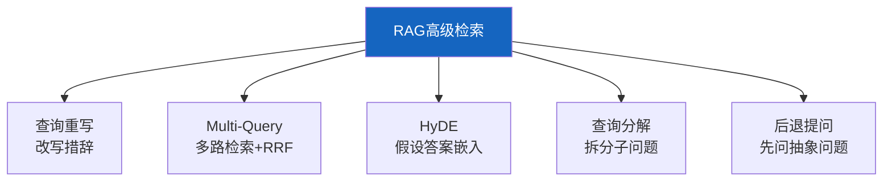
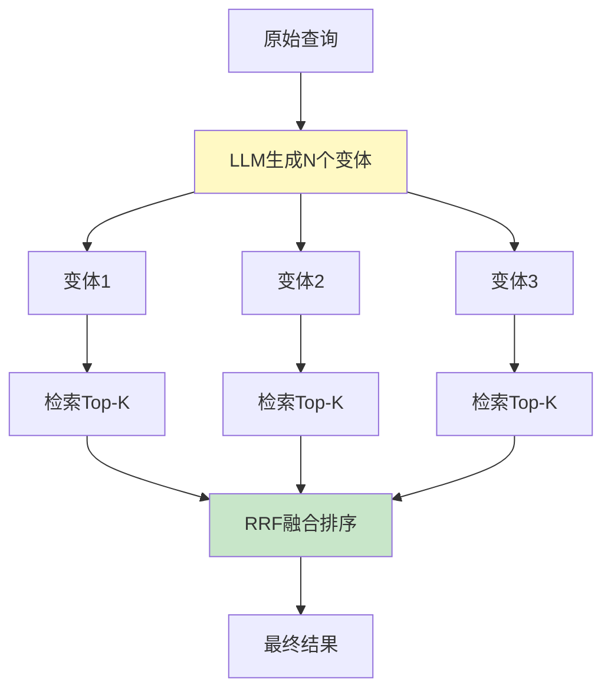
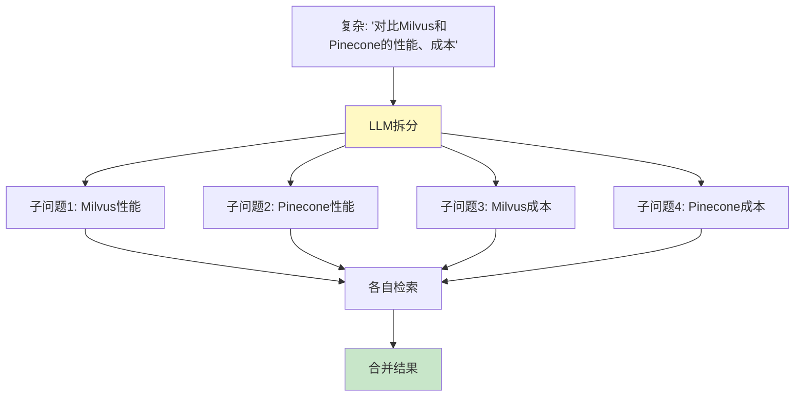
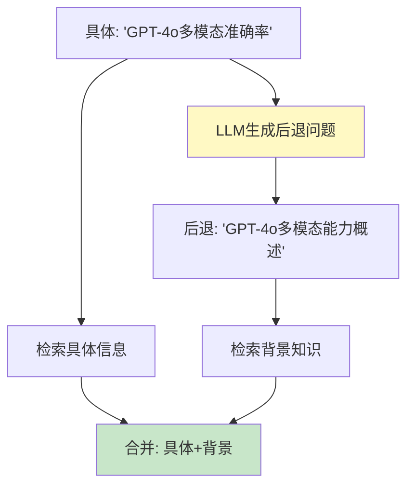
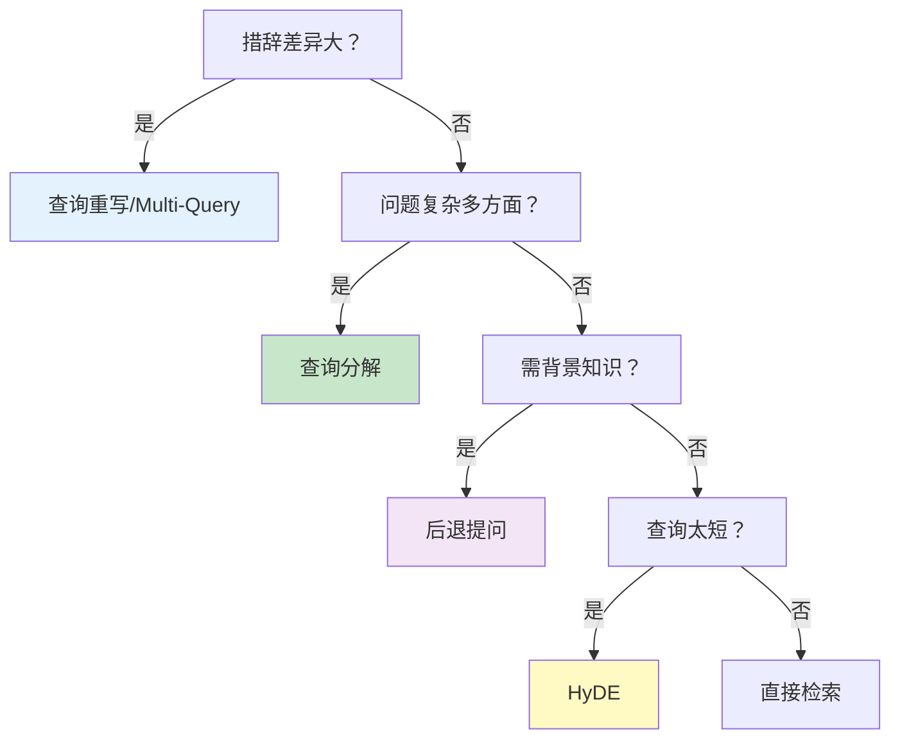

# RAG 高级检索策略图解

> 用图解理解 5 种查询重写与扩展策略的原理、适用场景和选型决策。

---

## 一、为什么需要查询重写

```mermaid
graph TB
    subgraph 问题 {"直接检索的盲区"}
        Q["用户: '怎么提升模型效果'"] --> MISS["❌ 文档写的是'提高模型性能'<br/>措辞不同，召回失败"]
    end

    subgraph 解决 {"查询重写后"}
        Q2["原始查询"] --> RW["重写为多个变体"]
        RW --> HIT["✅ 匹配到不同措辞的文档"]
    end

    style 问题 fill:#FFCDD2
    style 解决 fill:#C8E6C9
```

---

## 二、五种策略总览



---

## 三、Multi-Query 流程



---

## 四、HyDE 原理


---

## 五、查询分解



---

## 六、后退提问



---

## 七、选型决策



---

## 八、RRF融合原理

```mermaid
graph TB
    subgraph RRF {"Reciprocal Rank Fusion"}
        L1["路1: A→B→C→D"]
        L2["路2: B→A→E→D"]
        L3["路3: A→E→B→C"]
        L1 & L2 & L3 --> F["score = Σ 1/(60+rank)"]
        F --> R["融合: A→B→C→D→E"]
    end

    style F fill:#FFF9C4
    style R fill:#C8E6C9
```

---

## 九、检查清单

| 检查项 | 状态 |
|--------|------|
| 理解查询重写原理 | ☐ |
| 实现了Multi-Query | ☐ |
| 理解HyDE原理 | ☐ |
| 能实现查询分解 | ☐ |
| 能实现后退提问 | ☐ |
| 有选型决策 | ☐ |
