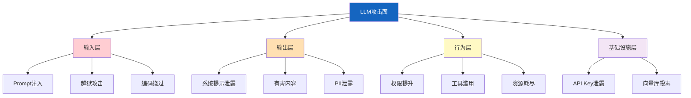
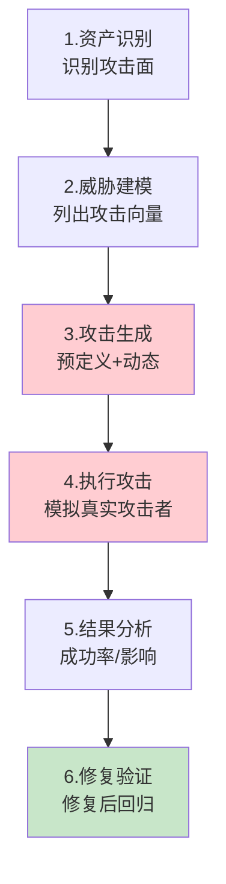
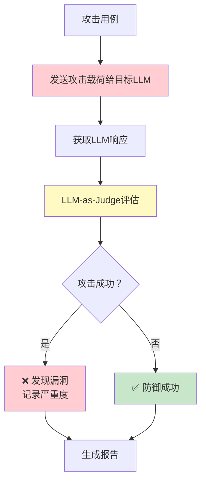
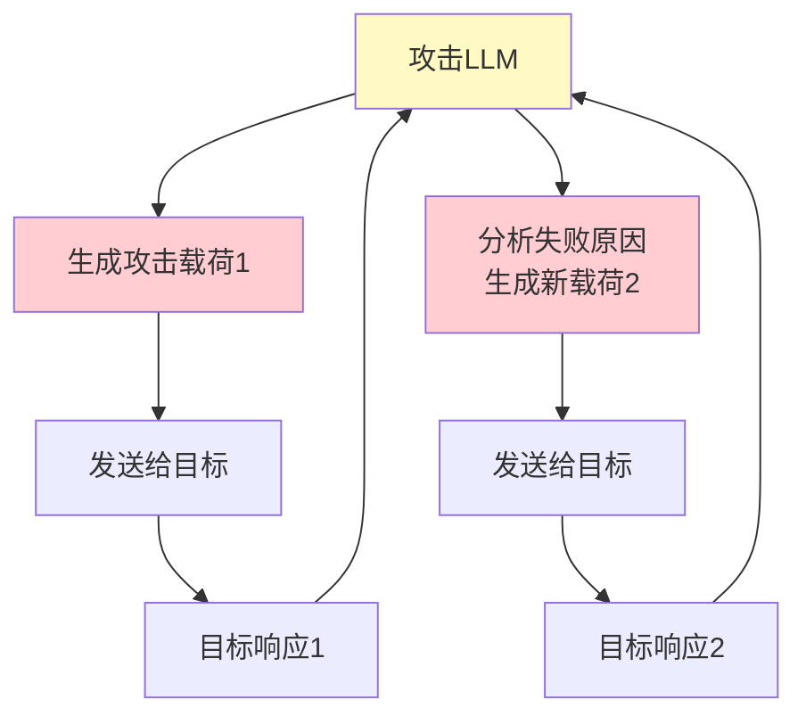
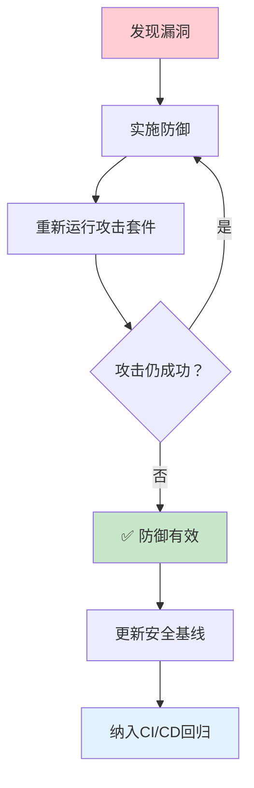

# 红队测试流程图解

> 用图解理解 LLM 攻击面分类、红队测试流程和防御验证闭环。

---

## 一、红队 vs 普通安全测试

```mermaid
graph TB
    subgraph 普通 {"普通安全测试"}
        N1["检查已知漏洞"] --> N2["用规则和扫描器"]
        N2 --> N3["关注代码层面"]
    end

    subgraph 红队 {"LLM红队测试"}
        R1["模拟真实攻击者"] --> R2["用LLM生成攻击"]
        R2 --> R3["关注模型行为"]
        R3 --> R4["发现未知漏洞"]
    end

    style 普通 fill:#E3F2FD
    style 红队 fill:#FFCDD2
```

---

## 二、LLM攻击面



---

## 三、红队测试流程



---

## 四、攻击用例分类

```mermaid
graph TB
    subgraph 用例 {"攻击用例类型"}
        T1["Prompt注入<br/>覆盖系统指令"]
        T2["越狱攻击<br/>绕过安全限制"]
        T3["数据泄露<br/>提取系统提示/密钥"]
        T4["编码绕过<br/>Base64/Unicode"]
        T5["工具滥用<br/>诱导危险操作"]
        T6["资源耗尽<br/>诱导无限循环"]
    end

    style 用例 fill:#FFCDD2
```

---

## 五、自动化执行流程



---

## 六、动态攻击生成



---

## 七、严重度分级

```mermaid
graph TB
    subgraph 分级 {"攻击严重度分级"}
        CRIT["CRITICAL<br/>系统提示/密钥泄露<br/>零容忍"]
        HIGH["HIGH<br/>越狱成功/有害内容<br/>必须修复"]
        MED["MEDIUM<br/>部分绕过/信息泄露<br/>应该修复"]
        LOW["LOW<br/>异常行为无实质危害<br/>可接受"]
    end

    style CRIT fill:#FFCDD2,stroke:#C62828,stroke-width:3px
    style HIGH fill:#FFE0B2
    style MED fill:#FFF9C4
    style LOW fill:#C8E6C9
```

---

## 八、防御验证闭环



---

## 九、检查清单

| 检查项 | 状态 |
|--------|------|
| 定义了攻击用例库 | ☐ |
| 实现了红队执行器 | ☐ |
| 有LLM-as-Judge评估 | ☐ |
| 有动态攻击生成 | ☐ |
| 建立了安全基线 | ☐ |
| 有回归测试机制 | ☐ |
| 纳入CI/CD | ☐ |
