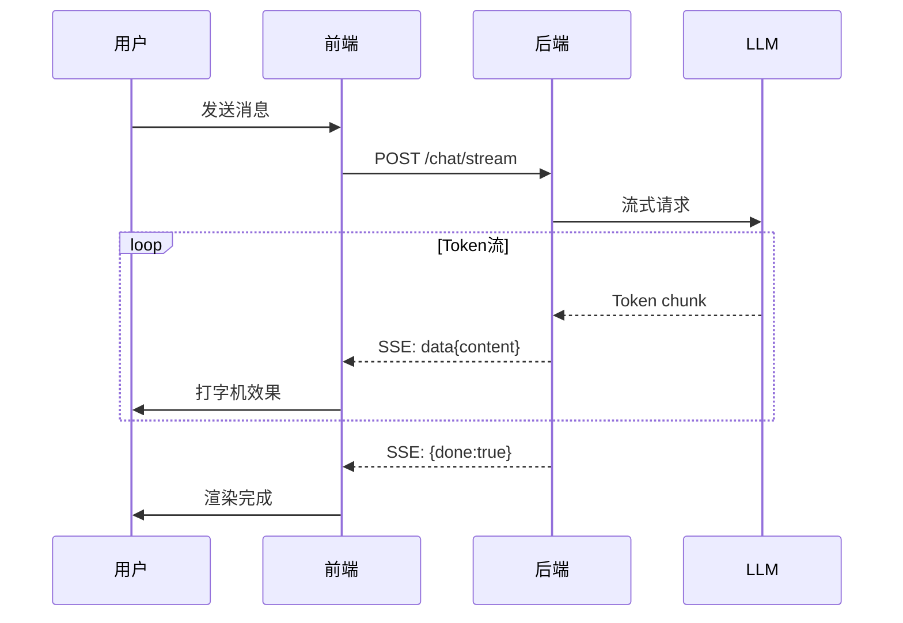
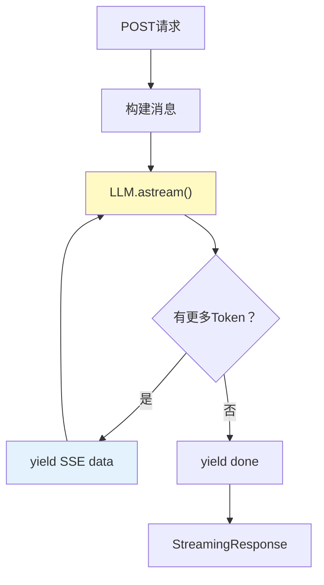
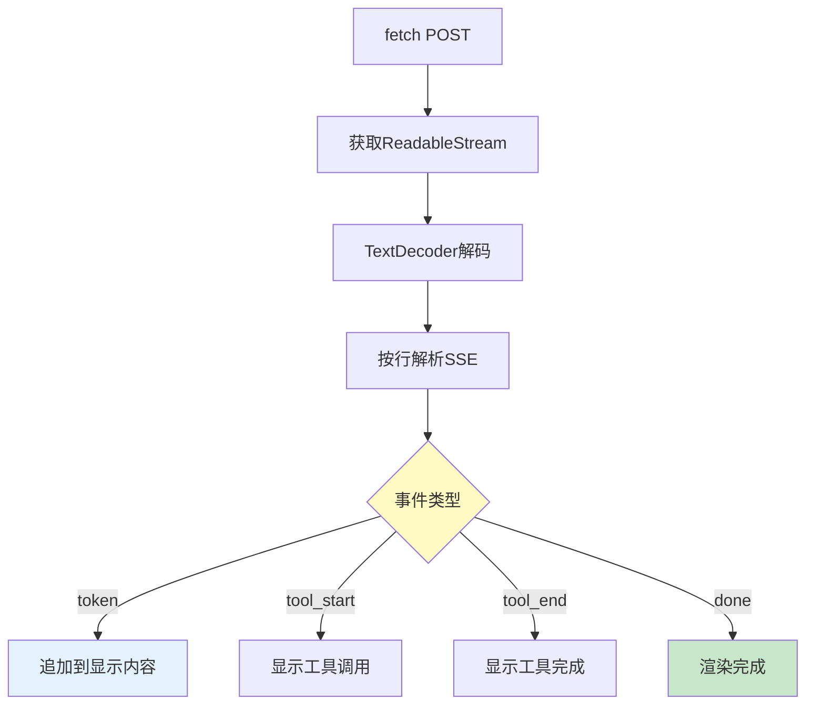

# 流式输出前端集成图解

> 用图解理解 SSE 流式全链路、React/Vue 集成和体验优化策略。

---

## 一、流式全链路



---

## 二、SSE vs WebSocket

```mermaid
graph TB
    subgraph SSE {"SSE ✅推荐"}
        S1["单向: 服务器→客户端"]
        S2["HTTP协议"]
        S3["自动重连"]
        S4["简单可靠"]
    end

    subgraph WS {"WebSocket"}
        W1["双向"]
        W2["独立协议"]
        W3["需手动重连"]
        W4["复杂"]
    end

    style SSE fill:#C8E6C9,stroke:#2E7D32,stroke-width:3px
    style WS fill:#FFF3E0
```

---

## 三、后端SSE流程



---

## 四、前端消费流程



---

## 五、打字机效果

```mermaid
graph LR
    subgraph 渲染 {"打字机渲染策略"}
        R1["LLM按chunk返回<br/>不需要逐字模拟"]
        R2["每个chunk追加到content"]
        R3["Markdown流式渲染<br/>边生成边格式化"]
        R4["光标闪烁表示生成中"]
    end

    style 渲染 fill:#E3F2FD
```

---

## 六、体验优化

```mermaid
graph TB
    subgraph 优化 {"5个体验优化点"}
        E1["首Token快<br/>TTFT<500ms"]
        E2["自动滚动<br/>用户上滚时暂停"]
        E3["停止生成<br/>可中断保留内容"]
        E4["Markdown渲染<br/>代码块/表格/列表"]
        E5["错误恢复<br/>断线重连"]
    end

    style 优化 fill:#C8E6C9
```

---

## 七、Agent流式

```mermaid
graph TB
    subgraph Agent流式 {"Agent模式事件流"}
        A1["on_chat_model_stream<br/>LLM Token流"]
        A2["on_tool_start<br/>工具调用开始"]
        A3["on_tool_end<br/>工具调用完成"]
        A1 & A2 & A3 --> UI["前端分别渲染<br/>Token流+工具进度"]
    end

    style Agent流式 fill:#E3F2FD
```

---

## 八、检查清单

| 检查项 | 状态 |
|--------|------|
| 后端有SSE端点 | ☐ |
| 前端能消费SSE流 | ☐ |
| 有打字机效果 | ☐ |
| 流式Markdown渲染 | ☐ |
| 有停止生成 | ☐ |
| 自动滚动优化 | ☐ |
| Agent展示工具进度 | ☐ |
