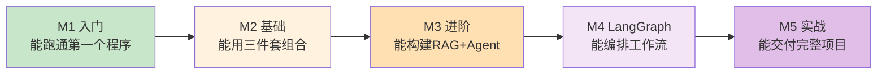
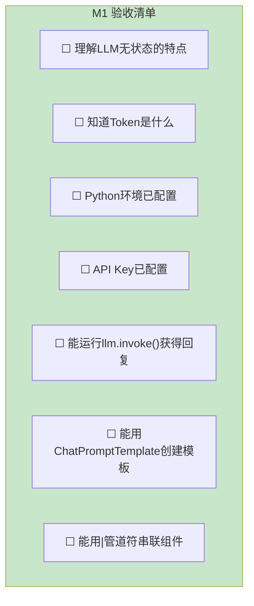
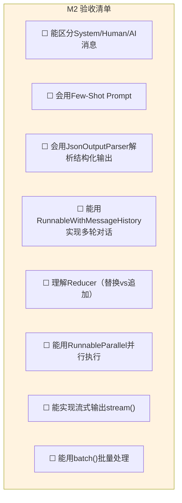
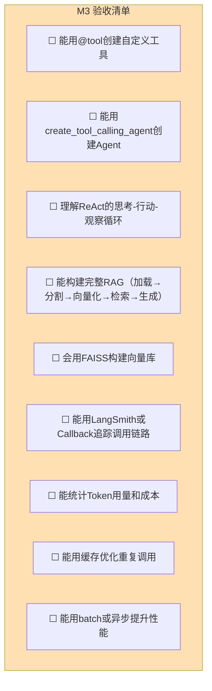
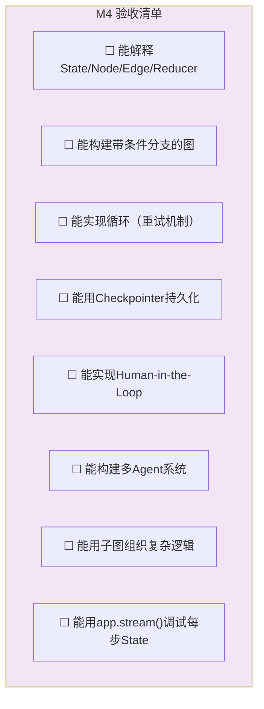
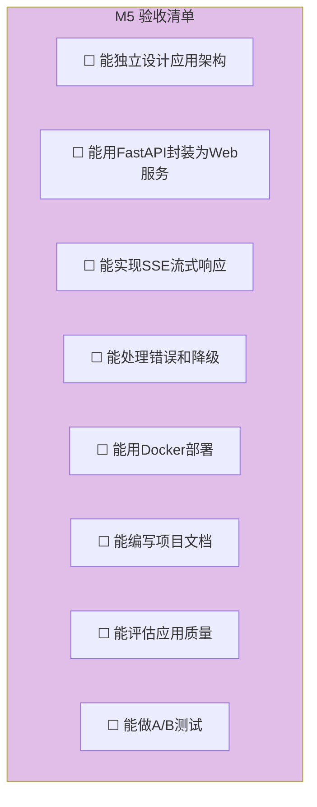
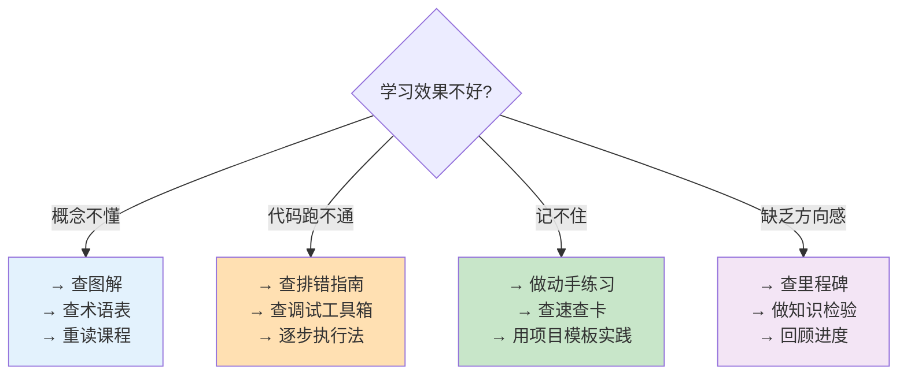

# 学习里程碑与进度跟踪

> 用这份清单跟踪你的学习进度，每个里程碑都标注了具体的验收标准。

---

## 里程碑全景



## M1：入门里程碑

**对应课程**：第 00-02 课
**预计时间**：第 1 周



**验收项目**：编写一个程序，用不同的 `temperature` 值调用 LLM 3 次，观察输出变化。

---

## M2：基础里程碑

**对应课程**：第 03-05 课
**预计时间**：第 2-3 周



**验收项目**：构建一个多轮对话助手，能记住用户姓名和偏好，支持流式输出。

---

## M3：进阶里程碑

**对应课程**：第 06-08 课
**预计时间**：第 3-5 周



**验收项目**：构建一个知识库问答系统，用户上传文档后能基于文档回答问题，回答时标注来源。

---

## M4：LangGraph 里程碑

**对应课程**：第 09-11 课
**预计时间**：第 5-6 周



**验收项目**：构建一个"生成→审查→修改"的自纠错系统，审查不通过时自动重试，最多 3 次。

---

## M5：实战里程碑

**对应课程**：第 12 课 + 实战案例库
**预计时间**：第 7-8 周



**验收项目**：独立设计并实现一个完整的 LLM 应用，包含：RAG + Agent + LangGraph + Web界面 + 错误处理。

---

## 进度跟踪表

| 里程碑 | 课程范围 | 验收项目 | 计划完成日期 | 实际完成日期 | 状态 |
|--------|----------|----------|-------------|-------------|------|
| M1 入门 | 00-02 | temperature对比 | ____/__/__ | ____/__/__ | ☐ |
| M2 基础 | 03-05 | 多轮对话助手 | ____/__/__ | ____/__/__ | ☐ |
| M3 进阶 | 06-08 | 知识库问答系统 | ____/__/__ | ____/__/__ | ☐ |
| M4 LangGraph | 09-11 | 自纠错系统 | ____/__/__ | ____/__/__ | ☐ |
| M5 实战 | 12+案例 | 完整应用项目 | ____/__/__ | ____/__/__ | ☐ |

## 每日学习记录模板

```
日期：____/__/__

今日学习课程：第__课 ____________
学习时长：____分钟

学到的关键概念：
1. ____________________
2. ____________________
3. ____________________

完成的动手练习：
☐ 练习1：____________________
☐ 练习2：____________________

遇到的困难：
______________________________

明日计划：
______________________________
```

## 学习建议


