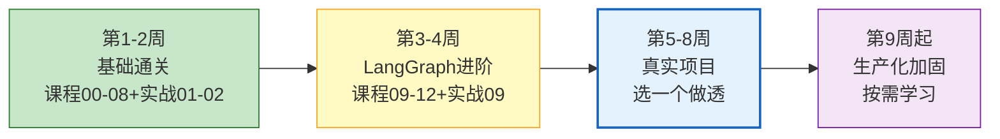

# 学习行动计划

> 你的学习资料库已有 1171 篇文档——资料够了，接下来是"怎么用"的问题。这份计划帮你从"读文档"转向"做项目"。

---

## 当前资料盘点

| 类别 | 数量 | 状态 |
|------|------|------|
| 学习课程 | 13 篇 | ✅ 完整（零基础到实战） |
| 知识库 | 556 篇 | ✅ 完整（基础+核心+工程+前沿+35+行业） |
| 图解 | 527 篇 | ✅ 完整（每篇知识库都有配套图解） |
| 实战案例 | 72 篇 | ✅ 完整（基础6+进阶6+行业59+导读1） |
| 学习评估 | 3 篇 | ⚠️ 需更新（题库只有12道，需扩充） |

**结论：资料已经远超需要，不要再读文档了，开始动手。**

---

## 第一阶段：基础通关（1-2 周）

### 目标

能独立搭建一个"LLM + Prompt + RAG"的基础问答系统。

### 任务清单

```
第 1 天：环境搭建
  □ 读：课程 00-01（总览+前置准备）
  □ 做：配置 Python 环境 + API Key
  □ 做：运行第一个 llm.invoke("你好")

第 2-3 天：核心三件套
  □ 读：课程 02-03（LangChain 入门+核心概念）
  □ 做：用 ChatPromptTemplate 写一个模板
  □ 做：用 | 管道符串联 Prompt → Model → Parser
  □ 查：知识库 03（LangChain 架构详解）、知识库 09（Prompt 工程）

第 4-5 天：Memory + Chains
  □ 读：课程 04-05（Memory+Chains）
  □ 做：实现一个能记住上下文的多轮对话
  □ 查：知识库 05（Memory 机制）、知识库 446（记忆架构）

第 6-7 天：RAG 基础
  □ 读：课程 07（RAG 检索增强生成）
  □ 做：上传一份文档，实现文档问答
  □ 查：知识库 03（RAG 全流程）、知识库 119（分块策略）
  □ 做实战：案例 02（多文档 RAG 问答系统）

第 8-10 天：Agent + Tools
  □ 读：课程 06（Agents 与 Tools）
  □ 做：给 Agent 加一个搜索工具和一个计算器
  □ 查：知识库 06（Agents 与 Tools）、知识库 15（工具调用全链路）
  □ 做实战：案例 01（智能客服机器人）
```

### 验收标准

- [ ] 能用 LangChain 写一个带 Memory 的多轮对话
- [ ] 能上传文档实现 RAG 问答
- [ ] 能给 Agent 添加自定义工具
- [ ] 用题库自测（里程碑 M1-M3）

---

## 第二阶段：LangGraph 进阶（1-2 周）

### 目标

掌握 LangGraph 图式编排，能构建带条件分支、循环、人机交互的工作流。

### 任务清单

```
第 1-3 天：LangGraph 核心
  □ 读：课程 09-10（LangGraph 入门+核心概念）
  □ 做：用 StateGraph 构建一个简单工作流
  □ 做：实现条件分支（if/else 路由）
  □ 查：知识库 04（LangGraph 架构）、知识库 127（Command API）

第 4-5 天：多 Agent 系统
  □ 读：课程 11（复杂工作流与多 Agent）
  □ 做：实现 Supervisor 模式（一个主管+两个专员）
  □ 查：知识库 462（Agent 设计模式）、知识库 437（OpenAI Agents SDK）

第 6-7 天：人机交互 + 持久化
  □ 做：实现 interrupt（暂停等待人工审批）
  □ 做：配置 Checkpointer 实现状态恢复
  □ 查：知识库 458（HITL）、知识库 441（LangGraph Platform）
  □ 做实战：案例 09（自动化工作流 Agent）
```

### 验收标准

- [ ] 能用 LangGraph 构建带条件路由的工作流
- [ ] 能实现多 Agent 协作（Supervisor 模式）
- [ ] 能实现人机交互（interrupt + 恢复）
- [ ] 用题库自测（里程碑 M4）

---

## 第三阶段：做一个真实项目（2-4 周）

### 目标

独立交付一个可演示的 Agent 项目，覆盖完整链路。

### 项目选择（选一个）

```
项目 A：智能知识库问答系统（推荐入门）
  技术栈：LangChain + RAG + LangGraph + FastAPI + 前端
  核心功能：
    - 文档上传+自动分块+向量化
    - 流式问答
    - 多轮对话记忆
    - 引用溯源
  参考案例：02-多文档RAG问答系统、10-进阶RAG问答系统
  参考知识库：03/16/119/121/430/494

项目 B：智能客服系统
  技术栈：LangGraph + RAG + 工具调用 + 情绪检测
  核心功能：
    - 意图识别+FAQ自动回答
    - 情绪检测+自动转人工
    - 工单创建
  参考案例：01-智能客服机器人、13-智能客服系统进阶
  参考知识库：512（对话状态机）、526（客服自动化）

项目 C：数据分析 Agent
  技术栈：LangGraph + 代码执行沙箱 + 数据可视化
  核心功能：
    - 自然语言查询数据
    - 自动生成图表
    - 洞察提取
  参考案例：04-数据分析对话助手、12-数据科学分析Agent
  参考知识库：517（数据分析与可视化）

项目 D：自动化工作流 Agent
  技术栈：LangGraph + interrupt + Cron + Webhook
  核心功能：
    - 定时触发任务
    - 人工审批流程
    - 多步骤编排
  参考案例：09-自动化工作流Agent
  参考知识库：485（Cron调度）、486（Webhook）、458（HITL）
```

### 交付要求

- [ ] 代码可运行（有 README + requirements.txt）
- [ ] 有前端界面（哪怕是终端）
- [ ] 有流式输出
- [ ] 有错误处理
- [ ] 有成本追踪
- [ ] 写一篇项目总结（遇到的问题+解决方案）

---

## 第四阶段：生产化加固（按需）

### 目标

把项目从"能跑"变成"能上线"。

### 按需学习清单

```
部署相关（选学）：
  □ Docker 容器化 → 知识库 489
  □ K8s 部署 → 知识库 489
  □ LangGraph Platform → 知识库 441

运维相关（选学）：
  □ 监控告警 → 知识库 502/503
  □ 日志管理 → 知识库 480
  □ 性能压测 → 知识库 499

安全相关（选学）：
  □ 数据脱敏 → 知识库 501
  □ 越狱防护 → 知识库 500
  □ 合规审计 → 知识库 451

工程化（选学）：
  □ CI/CD → 知识库 504
  □ 评测工具链 → 知识库 435
  □ 最佳实践 → 知识库 487
```

**原则：用到再查，不需要提前学。**

---

## 时间规划总览



---

## 文档使用指南

### 怎么用这 1171 篇文档

```
遇到问题时：
  1. 先查速查卡（学习评估/03-速查卡.md）——最常用的 API
  2. 查对应图解——快速理解概念
  3. 查知识库——深入细节
  4. 查实战案例——看代码怎么写

不要这样用：
  ❌ 从第 1 篇顺序读到第 556 篇
  ❌ 试图记住所有内容
  ❌ 每篇都精读

应该这样用：
  ✅ 课程按顺序学（00-12）
  ✅ 知识库当字典查（遇到问题再查）
  ✅ 图解当速查（快速回忆概念）
  ✅ 实战案例当参考（写代码时对照）
```

### 核心必读清单（如果只读 20 篇）

```
课程（全读）：
  00-课程总览、01-前置准备、02-LangChain入门
  03-核心概念、04-Memory、05-Chains
  06-Agents与Tools、07-RAG、08-进阶最佳实践
  09-LangGraph入门、10-核心概念、11-复杂工作流、12-实战项目

知识库（精选）：
  03-RAG全流程、119-分块策略、462-Agent设计模式
  487-最佳实践与反模式、516-踩坑实录

实战（精选）：
  01-智能客服、02-多文档RAG、09-自动化工作流
```

---

## 自测检查

每个阶段完成后，用以下问题自测：

### 基础阶段自测

```
□ 能解释 Token、Temperature、Context Window 吗？
□ 能用 LCEL 写一个 Prompt|Model|Parser 链吗？
□ 能实现多轮对话记忆吗？
□ 能搭建一个基础 RAG 系统吗？
□ 能给 Agent 添加自定义工具吗？
```

### LangGraph 阶段自测

```
□ 能解释 State、Node、Edge 的关系吗？
□ 能实现条件分支路由吗？
□ 能用 interrupt 实现人工审批吗？
□ 能实现多 Agent 协作吗？
□ 能配置 Checkpointer 实现状态恢复吗？
```

### 项目阶段自测

```
□ 项目能完整运行吗？
□ 有前端界面吗？
□ 有流式输出吗？
□ 有错误处理吗？
□ 能向别人演示并解释代码吗？
```

---

## 下一步建议

1. **今天就开始**：打开课程 00，配置环境，跑通第一个 `llm.invoke()`
2. **不要追求完美**：第一遍粗读，遇到不懂的标记下来继续往前
3. **代码为王**：每读完一课，必须写代码实践，不能只读不做
4. **遇到问题查文档**：1171 篇文档是你的参考库，不是必读清单
5. **做完一个项目**：比读 100 篇文档学到的更多
