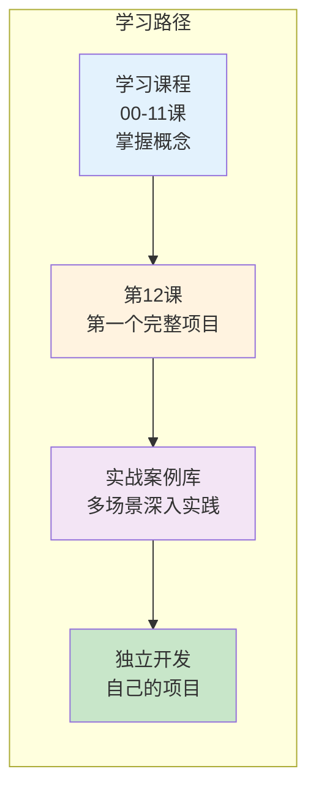

# 实战案例库导读

> 学完基础课程后，通过完整的实战案例将知识融会贯通。每个案例都是一个可独立运行的项目。

---

## 案例库定位

`学习课程/第12课` 教你搭建了一个知识库助手。`实战案例库` 在此基础上提供更多真实场景的完整项目，每个案例聚焦不同的技术组合。



## 案例总览

| 案例 | 核心技术 | 难度 | 涉及课程 |
|------|----------|------|----------|
| [01-智能客服机器人](01-智能客服机器人.md) | Memory + Agent + Tools + 条件路由 | ★★☆ | 04, 05, 06, 09 |
| [02-多文档RAG问答系统](02-多文档RAG问答系统.md) | RAG + 向量库 + 流式输出 + 引用溯源 | ★★☆ | 05, 07, 08 |
| [03-代码审查助手](03-代码审查助手.md) | LangGraph + 多Agent + Human-in-Loop | ★★★ | 06, 09, 10, 11 |
| [04-数据分析对话助手](04-数据分析对话助手.md) | Agent + Python工具 + LangGraph + 可视化 | ★★★ | 06, 09, 10 |

## 案例结构约定

每个案例遵循统一的结构，方便你对照学习：

```
1. 项目背景与目标          ← 为什么做这个、解决什么问题
2. 架构设计（含 Mermaid 图） ← 整体架构和数据流
3. 技术栈与依赖            ← 需要安装什么
4. 完整代码实现             ← 逐文件、逐函数讲解
5. 运行与测试              ← 如何跑起来、如何验证
6. 扩展方向                ← 课后挑战
```

## 前置要求

- 已完成学习课程 00-08 课（基础篇 + 进阶篇）
- 案例 03、04 额外需要 09-11 课（LangGraph 篇）
- 每个案例开头会标注具体前置课程
