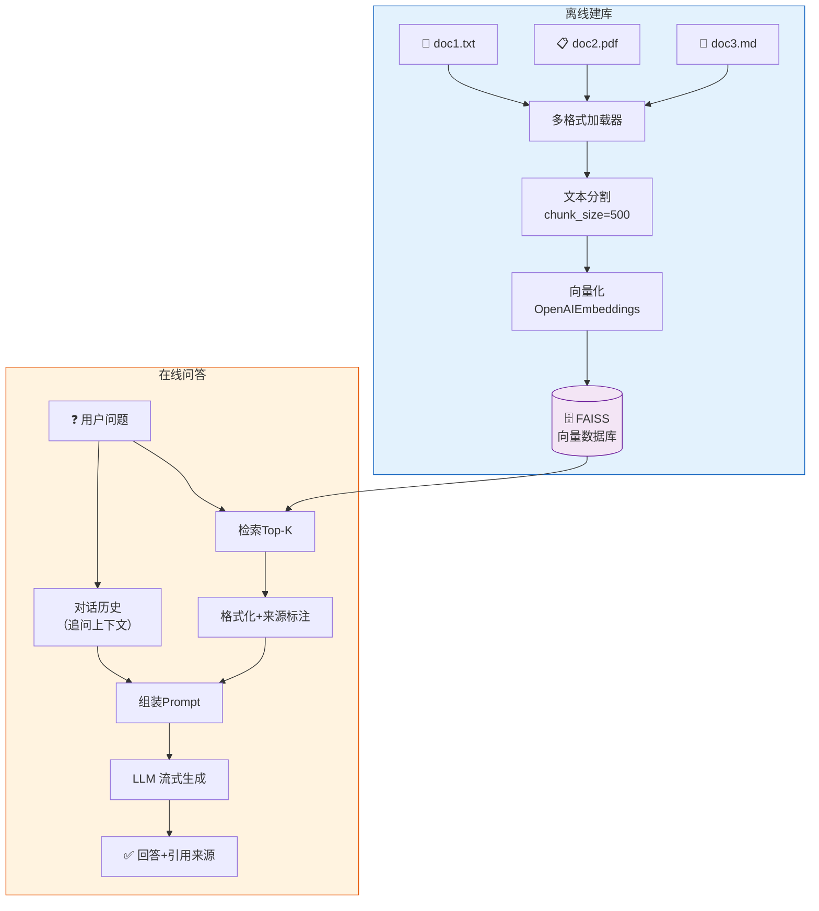
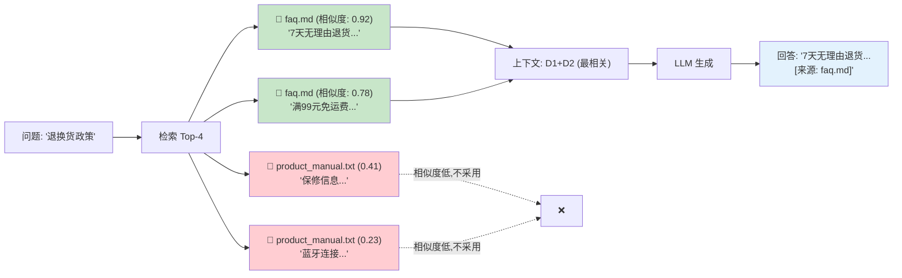

# 实战案例 02：多文档 RAG 问答系统

> 构建一个支持多文档、带引用溯源、流式输出的 RAG 问答系统。

---

## 一、项目背景与目标

### 背景

第 07 课学过 RAG 基础，但实际应用中需要：支持多种文档格式、回答时标注来源、流式输出提升体验。

### 目标

1. 支持 TXT、PDF、Markdown 多种格式
2. 多文档统一构建向量知识库
3. 回答时附带来源引用（哪个文档、哪一段）
4. 流式输出回答
5. 对话记忆支持追问

### 架构



## 二、技术栈与依赖

```bash
pip install langchain langchain-openai langchain-community faiss-cpu pypdf python-dotenv
```

前置课程：第 05 课（Chains）、第 07 课（RAG）、第 08 课（进阶）

## 三、完整代码实现

### 3.1 项目结构

```
multi_doc_rag/
├── .env
├── main.py              ← 主入口
├── document_loader.py   ← 多格式文档加载
├── rag_engine.py        ← RAG 引擎核心
└── docs/                ← 文档目录
    ├── product_manual.txt
    ├── faq.md
    └── report.pdf
```

### 3.2 多格式文档加载器

```python
# document_loader.py
import os
from langchain_core.documents import Document
from langchain_community.document_loaders import (
    TextLoader,
    PyPDFLoader,
    UnstructuredMarkdownLoader,
)

def load_documents_from_dir(docs_dir: str = "docs") -> list[Document]:
    """从目录加载所有支持的文档格式"""
    all_docs = []
    
    for filename in os.listdir(docs_dir):
        filepath = os.path.join(docs_dir, filename)
        
        try:
            if filename.endswith(".txt"):
                loader = TextLoader(filepath, encoding="utf-8")
                docs = loader.load()
                # 确保每个文档都有 source 元数据
                for d in docs:
                    d.metadata["source"] = filename
                    d.metadata["file_type"] = "txt"
                all_docs.extend(docs)
                
            elif filename.endswith(".pdf"):
                loader = PyPDFLoader(filepath)
                docs = loader.load()
                for d in docs:
                    d.metadata["source"] = filename
                    d.metadata["file_type"] = "pdf"
                all_docs.extend(docs)
                
            elif filename.endswith(".md"):
                loader = UnstructuredMarkdownLoader(filepath)
                docs = loader.load()
                for d in docs:
                    d.metadata["source"] = filename
                    d.metadata["file_type"] = "md"
                all_docs.extend(docs)
                
        except Exception as e:
            print(f"⚠️ 加载 {filename} 失败: {e}")
    
    print(f"✅ 共加载 {len(all_docs)} 个文档段落")
    for d in all_docs:
        print(f"   - {d.metadata['source']} ({len(d.page_content)} 字符)")
    
    return all_docs
```

### 3.3 RAG 引擎核心

```python
# rag_engine.py
from langchain_openai import ChatOpenAI, OpenAIEmbeddings
from langchain_community.vectorstores import FAISS
from langchain_text_splitters import RecursiveCharacterTextSplitter
from langchain_core.prompts import ChatPromptTemplate, MessagesPlaceholder
from langchain_core.output_parsers import StrOutputParser
from langchain_core.runnables import RunnablePassthrough, RunnableLambda
from langchain_core.messages import HumanMessage, AIMessage
from langchain_core.documents import Document

class RAGEngine:
    def __init__(self):
        self.llm = ChatOpenAI(model="gpt-4o-mini", temperature=0)
        self.embeddings = OpenAIEmbeddings()
        self.vectorstore = None
        self.retriever = None
        self.chain = None
    
    def build_index(self, documents: list[Document]):
        """构建向量索引"""
        splitter = RecursiveCharacterTextSplitter(
            chunk_size=500,
            chunk_overlap=80,
            separators=["\n\n", "\n", "。", "！", "？", "；", "，", " ", ""]
        )
        chunks = splitter.split_documents(documents)
        print(f"✅ 分割为 {len(chunks)} 个文档块")
        
        self.vectorstore = FAISS.from_documents(chunks, self.embeddings)
        self.retriever = self.vectorstore.as_retriever(
            search_kwargs={"k": 4}
        )
        self._build_chain()
        print("✅ RAG 引擎构建完成")
    
    def _build_chain(self):
        """构建 RAG 链"""
        prompt = ChatPromptTemplate.from_messages([
            ("system", """你是一个知识库问答助手。基于以下背景知识回答用户问题。

规则：
1. 只基于背景知识回答，不要编造信息
2. 如果背景知识中没有答案，明确说"知识库中未找到相关信息"
3. 回答时在关键信息后标注来源，格式：[来源: 文件名]
4. 回答要简洁、准确、有条理

背景知识：
{context}"""),
            MessagesPlaceholder(variable_name="history"),
            ("human", "{question}"),
        ])
        
        def format_docs_with_sources(docs: list[Document]) -> str:
            """格式化检索结果，附带来源标注"""
            formatted = []
            for i, doc in enumerate(docs, 1):
                source = doc.metadata.get("source", "未知来源")
                formatted.append(f"[片段{i} | 来源: {source}]\n{doc.page_content}")
            return "\n\n".join(formatted)
        
        self.chain = (
            {
                "context": self.retriever | RunnableLambda(format_docs_with_sources),
                "history": RunnableLambda(lambda x: x.get("history", [])),
                "question": RunnableLambda(lambda x: x["question"]),
            }
            | prompt
            | self.llm
            | StrOutputParser()
        )
    
    def ask(self, question: str, history: list = None) -> str:
        """同步问答"""
        result = self.chain.invoke({
            "question": question,
            "history": history or [],
        })
        return result
    
    def ask_stream(self, question: str, history: list = None):
        """流式问答（生成器）"""
        for chunk in self.chain.stream({
            "question": question,
            "history": history or [],
        }):
            yield chunk
    
    def search(self, query: str, k: int = 4) -> list[Document]:
        """直接检索（调试用）"""
        return self.vectorstore.similarity_search(query, k=k)
    
    def get_sources(self, query: str, k: int = 4) -> list[str]:
        """获取检索来源列表"""
        docs = self.search(query, k=k)
        sources = []
        for doc in docs:
            source = doc.metadata.get("source", "未知")
            preview = doc.page_content[:80].replace("\n", " ")
            sources.append(f"📄 {source}: {preview}...")
        return sources
```

### 3.4 主程序

```python
# main.py
import os
from dotenv import load_dotenv
from langchain_core.messages import HumanMessage, AIMessage
from document_loader import load_documents_from_dir
from rag_engine import RAGEngine

load_dotenv()

def main():
    print("=" * 55)
    print("  多文档 RAG 问答系统")
    print("=" * 55)
    
    # 初始化示例文档（如果docs目录为空）
    docs_dir = "docs"
    if not os.path.exists(docs_dir):
        os.makedirs(docs_dir)
    
    if not os.listdir(docs_dir):
        with open(os.path.join(docs_dir, "product_manual.txt"), "w", encoding="utf-8") as f:
            f.write("""产品使用手册

第一章 产品概述
本产品是一款智能蓝牙耳机，型号BT-Pro。支持主动降噪、蓝牙5.3、32小时续航。
充电方式：Type-C接口，支持快充（充电10分钟使用2小时）。
防水等级：IPX5，可防雨水和汗水，但不建议游泳佩戴。

第二章 常见问题
Q: 耳机无法连接蓝牙？
A: 1. 确认耳机已开机（长按3秒）；2. 检查手机蓝牙是否开启；3. 尝试忘记设备后重新配对。

Q: 降噪效果不好？
A: 请确保耳塞尺寸合适（附赠S/M/L三种尺寸），选择合适的耳塞可以显著提升降噪效果。

第三章 保修信息
本产品提供1年免费保修。保修不覆盖人为损坏、进水（超出IPX5等级）、外观磨损。
""")
        with open(os.path.join(docs_dir, "faq.md"), "w", encoding="utf-8") as f:
            f.write("""# 常见问题汇总

## 退换货政策
- 7天无理由退货
- 15天换货
- 商品需保持完好，包装齐全
- 退款3-5个工作日到账

## 支付方式
- 微信支付
- 支付宝
- 银行卡
- 分期付款（满500元可用）

## 配送说明
- 全国大部分地区次日达
- 偏远地区3-5个工作日
- 满99元免运费
""")
        print(f"✅ 已创建示例文档于 {docs_dir}/")
    
    # 加载文档
    documents = load_documents_from_dir(docs_dir)
    if not documents:
        print("❌ 没有找到文档，请将文档放入 docs/ 目录")
        return
    
    # 构建 RAG 引擎
    engine = RAGEngine()
    engine.build_index(documents)
    
    # 对话循环
    history = []
    print("\n💡 命令: quit=退出 | stream=切换流式 | sources=查看来源 | clear=清空历史\n")
    
    use_stream = True
    
    while True:
        user_input = input("👤 问: ").strip()
        
        if user_input.lower() == "quit":
            break
        elif user_input.lower() == "clear":
            history = []
            print("🧹 已清空对话历史\n")
            continue
        elif user_input.lower() == "stream":
            use_stream = not use_stream
            print(f"🔄 流式输出: {'开启' if use_stream else '关闭'}\n")
            continue
        elif user_input.lower() == "sources":
            query = input("输入查询: ")
            sources = engine.get_sources(query)
            print("\n📚 检索来源:")
            for s in sources:
                print(f"  {s}")
            print()
            continue
        elif not user_input:
            continue
        
        # 显示检索来源
        sources = engine.get_sources(user_input)
        print(f"\n📚 参考来源: {len(sources)} 个文档片段")
        
        # 回答
        if use_stream:
            print("\n🤖 答: ", end="", flush=True)
            full_answer = ""
            for chunk in engine.ask_stream(user_input, history):
                print(chunk, end="", flush=True)
                full_answer += chunk
            print("\n")
        else:
            print(f"\n🤖 答: {engine.ask(user_input, history)}\n")
        
        # 更新历史
        history.append(HumanMessage(content=user_input))
        history.append(AIMessage(content=full_answer if use_stream else engine.ask(user_input, history[:-1])))

if __name__ == "__main__":
    main()
```

## 四、运行与测试

```bash
# 1. 配置
echo "OPENAI_API_KEY=你的密钥" > .env

# 2. 运行
python main.py

# 3. 测试
# 问: "耳机的充电方式是什么？"
# 问: "退换货政策是什么？"（来自不同文档）
# 问: "保修范围包括什么？"
# 输入 sources 查看检索来源
# 输入 stream 切换流式/非流式
```

### 引用溯源效果



## 五、扩展方向

1. 保存/加载 FAISS 索引避免重复构建
2. 添加重排序（reranking）提升检索质量
3. 支持文档增量添加（不重建整个索引）
4. 添加对话历史截断策略
5. 用 FastAPI 封装为 Web API
