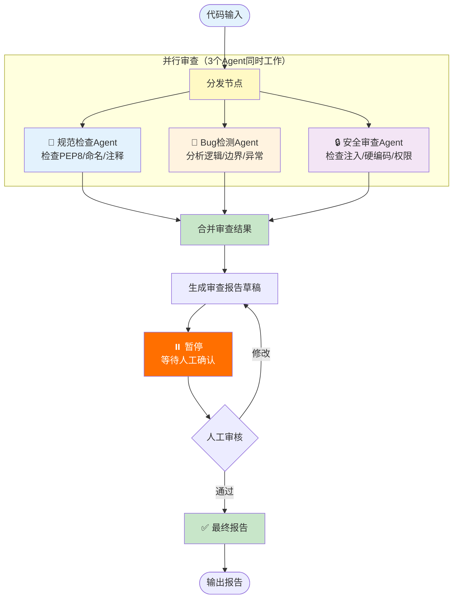

# 实战案例 03：代码审查助手

> 用 LangGraph 构建多 Agent 代码审查系统：静态分析 → AI 审查 → 人工确认 → 生成报告。

---

## 一、项目背景与目标

### 背景

代码审查是保证代码质量的关键环节。用多 Agent 系统可以：自动检查代码规范、分析潜在Bug、审查安全风险，最后由人工确认。

### 目标

1. 多 Agent 协作：规范检查 Agent + Bug 检测 Agent + 安全审查 Agent
2. 三个 Agent 并行执行，合并结果
3. 人工确认环节（Human-in-the-Loop）
4. 生成结构化审查报告

### 架构



## 二、技术栈与依赖

```bash
pip install langchain langchain-openai langgraph python-dotenv
```

前置课程：第 06 课（Agents）、第 09-11 课（LangGraph 全部）

## 三、完整代码实现

### 3.1 State 定义

```python
from typing import TypedDict, Annotated
from operator import add

class ReviewState(TypedDict):
    code: str                        # 待审查的代码
    language: str                     # 编程语言
    style_issues: str                 # 规范问题
    bug_issues: str                   # Bug问题
    security_issues: str             # 安全问题
    combined_report: str              # 合并报告
    final_report: str                 # 最终报告
    human_feedback: str              # 人工反馈
    approved: bool                    # 是否通过
```

### 3.2 Agent 节点

```python
from dotenv import load_dotenv
from langchain_openai import ChatOpenAI
from langchain_core.prompts import ChatPromptTemplate
from langchain_core.output_parsers import StrOutputParser
from langgraph.graph import StateGraph, START, END
from langgraph.checkpoint.memory import MemorySaver

load_dotenv()
llm = ChatOpenAI(model="gpt-4o-mini", temperature=0)

def style_review_node(state: ReviewState) -> dict:
    """规范检查Agent"""
    prompt = ChatPromptTemplate.from_template(
        """你是代码规范审查专家。检查以下{language}代码的规范性问题：

检查项：
1. 命名规范（变量、函数、类）
2. 代码格式（缩进、空格、换行）
3. 注释完整性
4. 代码结构（函数长度、嵌套深度）

代码：
```
{code}
```

请列出发现的问题，每条格式：[严重程度: 高/中/低] 问题描述。如果没有问题，回复"规范检查通过"。"""
    )
    chain = prompt | llm | StrOutputParser()
    result = chain.invoke({"code": state["code"], "language": state["language"]})
    return {"style_issues": result}

def bug_review_node(state: ReviewState) -> dict:
    """Bug检测Agent"""
    prompt = ChatPromptTemplate.from_template(
        """你是Bug检测专家。分析以下{language}代码中的潜在Bug：

检查项：
1. 空指针/None引用风险
2. 边界条件处理
3. 异常处理是否完善
4. 逻辑错误
5. 资源泄漏（未关闭文件/连接）

代码：
```
{code}
```

请列出发现的潜在Bug，每条格式：[严重程度: 高/中/低] 问题描述 + 建议修复。如果没有问题，回复"Bug检查通过"。"""
    )
    chain = prompt | llm | StrOutputParser()
    result = chain.invoke({"code": state["code"], "language": state["language"]})
    return {"bug_issues": result}

def security_review_node(state: ReviewState) -> dict:
    """安全审查Agent"""
    prompt = ChatPromptTemplate.from_template(
        """你是安全审查专家。检查以下{language}代码的安全风险：

检查项：
1. SQL注入风险
2. 硬编码密钥/密码
3. 不安全的输入处理
4. 权限控制问题
5. 敏感信息泄露

代码：
```
{code}
```

请列出安全风险，每条格式：[严重程度: 高/中/低] 风险描述 + 修复建议。如果没有问题，回复"安全检查通过"。"""
    )
    chain = prompt | llm | StrOutputParser()
    result = chain.invoke({"code": state["code"], "language": state["language"]})
    return {"security_issues": result}

def merge_node(state: ReviewState) -> dict:
    """合并三个Agent的审查结果"""
    report = f"""# 代码审查报告

## 📏 规范检查
{state['style_issues']}

## 🐛 Bug检测
{state['bug_issues']}

## 🔒 安全审查
{state['security_issues']}

---
请人工审核以上报告，确认后输出最终版本。"""
    return {"combined_report": report}

def final_report_node(state: ReviewState) -> dict:
    """生成最终报告"""
    feedback = state.get("human_feedback", "")
    report = state["combined_report"]
    if feedback:
        report += f"\n\n## 📝 人工审核意见\n{feedback}"
    report += "\n\n## ✅ 审查完成"
    return {"final_report": report, "approved": True}
```

### 3.3 图定义与主程序

```python
# 构建图
graph = StateGraph(ReviewState)

# 添加节点
graph.add_node("style_review", style_review_node)
graph.add_node("bug_review", bug_review_node)
graph.add_node("security_review", security_review_node)
graph.add_node("merge", merge_node)
graph.add_node("final", final_report_node)

# 并行：START 同时指向三个审查节点
graph.add_edge(START, "style_review")
graph.add_edge(START, "bug_review")
graph.add_edge(START, "security_review")

# 三个都完成后到 merge
graph.add_edge("style_review", "merge")
graph.add_edge("bug_review", "merge")
graph.add_edge("security_review", "merge")

# merge 后暂停（Human-in-the-Loop）
graph.add_edge("merge", "final")

graph.add_edge("final", END)

# 编译（在 final 之前暂停，等人工确认）
app = graph.compile(
    checkpointer=MemorySaver(),
    interrupt_before=["final"]
)

# ========== 运行 ==========

def review_code(code: str, language: str = "Python"):
    """审查代码的完整流程"""
    config = {"configurable": {"thread_id": "review_001"}}
    
    print("🔍 开始代码审查...\n")
    
    # 第一阶段：执行到 merge 完成后暂停
    result = app.invoke(
        {
            "code": code,
            "language": language,
            "style_issues": "",
            "bug_issues": "",
            "security_issues": "",
            "combined_report": "",
            "final_report": "",
            "human_feedback": "",
            "approved": False,
        },
        config=config
    )
    
    # 显示草稿报告
    print("=" * 55)
    print("📋 审查报告草稿")
    print("=" * 55)
    print(result["combined_report"])
    print("=" * 55)
    
    # 等待人工反馈
    feedback = input("\n📝 请输入审核意见（直接回车表示通过）: ").strip()
    
    if feedback:
        app.update_state(config, {"human_feedback": feedback})
    
    # 继续：生成最终报告
    result = app.invoke(None, config=config)
    
    print("\n" + "=" * 55)
    print("✅ 最终审查报告")
    print("=" * 55)
    print(result["final_report"])
    
    return result

# 测试
if __name__ == "__main__":
    test_code = """
import os

def get_user_data(user_id):
    conn = sqlite3.connect("app.db")
    cursor = conn.cursor()
    query = "SELECT * FROM users WHERE id = " + user_id
    cursor.execute(query)
    result = cursor.fetchone()
    return result

API_KEY = "sk-1234567890abcdef"

def delete_user(user_id):
    conn = sqlite3.connect("app.db")
    cursor = conn.cursor()
    cursor.execute("DELETE FROM users WHERE id = " + user_id)
    conn.commit()
"""
    
    review_code(test_code, "Python")
```

## 四、运行效果

```mermaid
sequenceDiagram
    participant U as 用户
    participant G as LangGraph
    participant S as 规范Agent
    participant B as BugAgent
    participant SE as 安全Agent

    U->>G: 提交代码
    G->>S: 并行分发
    G->>B: 并行分发
    G->>SE: 并行分发

    Note over S,B,SE: 三个Agent同时工作

    S-->>G: 规范检查结果
    B-->>G: Bug检测结果
    SE-->>G: 安全检查结果

    G->>G: 合并报告
    G-->>U: 显示草稿报告 ⏸️

    U->>G: 输入审核意见
    G->>G: 生成最终报告
    G-->>U: 输出最终报告 ✅
```

## 五、扩展方向

1. 添加第四个 Agent：性能分析
2. 接入真实静态分析工具（pylint、bandit）作为工具
3. 支持 Git diff 输入，只审查变更部分
4. 生成 HTML 格式的可视化报告
5. 集成到 CI/CD 流程
